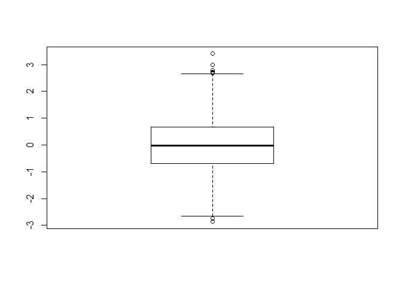
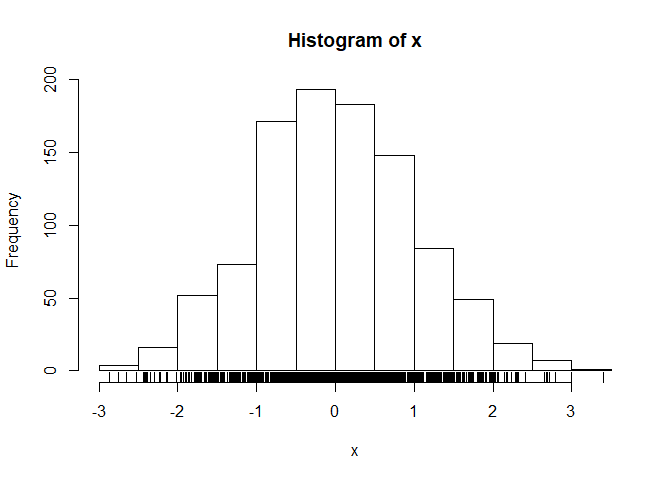
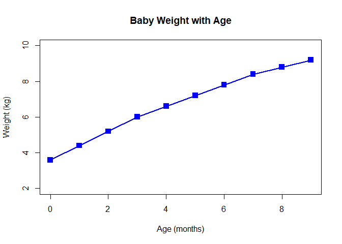
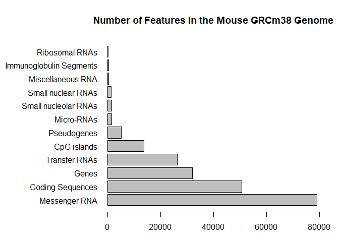
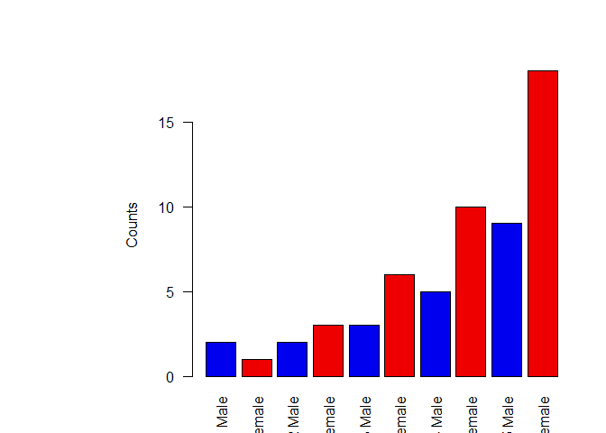

Data exploration and visualization
================
Christopher Lee
October 15, 2019

``` r
# Class 5 Data Visualization
x <- rnorm(1000)

# Some summary stats
mean(x)
```

    ## [1] 0.01122798

``` r
sd(x)
```

    ## [1] 1.009265

``` r
summary(x)
```

    ##     Min.  1st Qu.   Median     Mean  3rd Qu.     Max. 
    ## -2.86551 -0.68408 -0.02450  0.01123  0.65689  3.40305

``` r
boxplot(x)
```

<!-- -->

``` r
hist(x)
rug(x)
```

<!-- -->

``` r
# Section 2 Scatterplot
# Lets read our input file first

baby <- read.table("bimm143_05_rstats/weight_chart.txt", header = TRUE)
plot(baby$Age, baby$Weight, type = "o", 
     pch = 15, cex = 1.5, lwd = 2, ylim = c(2,10), 
     xlab = "Age (months)", ylab = "Weight (kg)", 
     main = "Baby Weight with Age", col = "blue")
```

<!-- -->

``` r
?plot
```

    ## starting httpd help server ... done

``` r
mouse <- read.table(file = "bimm143_05_rstats/feature_counts.txt", header = TRUE, sep = "\t")
mouse
```

    ##                    Feature Count
    ## 1            Messenger RNA 79049
    ## 2         Coding Sequences 50770
    ## 3                    Genes 32029
    ## 4            Transfer RNAs 26248
    ## 5              CpG islands 13840
    ## 6              Pseudogenes  5195
    ## 7               Micro-RNAs  1638
    ## 8     Small nucleolar RNAs  1602
    ## 9       Small nuclear RNAs  1431
    ## 10       Miscellaneous RNA   491
    ## 11 Immunoglobulin Segments   474
    ## 12          Ribosomal RNAs   341

``` r
par(mar=c(3.1, 11.1, 4.1, 2))
barplot(mouse$Count, horiz = TRUE, 
        names.arg = mouse$Feature, 
        las = 1, 
        main = "Number of Features in the Mouse GRCm38 Genome", 
        ylab = "", xlim = c(0,80000))
```

<!-- -->

``` r
sex <- read.table("bimm143_05_rstats/male_female_counts.txt", header = TRUE, sep = "\t")
sex
```

    ##       Sample Count
    ## 1    D1 Male     2
    ## 2  D1 Female     1
    ## 3    D2 Male     2
    ## 4  D2 Female     3
    ## 5    D3 Male     3
    ## 6  D3 Female     6
    ## 7    D4 Male     5
    ## 8  D4 Female    10
    ## 9    D5 Male     9
    ## 10 D5 Female    18

``` r
barplot(sex$Count, ylab = "Counts", names.arg = sex$Sample, las = 2, col = c("blue2", "red2"))
```

<!-- -->
