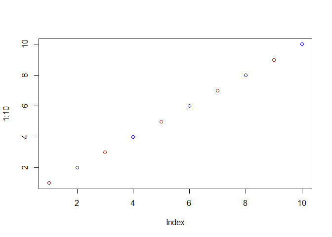

Class 7 R Functions and Packagaes
================
Chris
10/22/2019

## R functions revisited

Source my functions from last day

``` r
source("http://tinyurl.com/rescale-R")
```

``` r
rescale(1:10)
```

    ##  [1] 0.0000000 0.1111111 0.2222222 0.3333333 0.4444444 0.5555556 0.6666667
    ##  [8] 0.7777778 0.8888889 1.0000000

``` r
rescale(c(1, 10, 5, NA, 6))
```

    ## [1] 0.0000000 1.0000000 0.4444444        NA 0.5555556

``` r
rescale2(1:10)
```

    ##  [1] 0.0000000 0.1111111 0.2222222 0.3333333 0.4444444 0.5555556 0.6666667
    ##  [8] 0.7777778 0.8888889 1.0000000

Write a new function called bothna() to find where there are NA elements
in two input vectors.

First make some simple input where I know the answer

``` r
x <- c( 1, 2, NA, 3, NA)

y <- c(NA, 3, NA, 3, 4)
```

Looked online and found **is.na()** function

``` r
is.na(x)
```

    ## [1] FALSE FALSE  TRUE FALSE  TRUE

and the **which()** function tells me where the TRUE values are

``` r
which(is.na(x))
```

    ## [1] 3 5

``` r
which(is.na(y))
```

    ## [1] 1 3

``` r
is.na(x)
```

    ## [1] FALSE FALSE  TRUE FALSE  TRUE

``` r
is.na(y)
```

    ## [1]  TRUE FALSE  TRUE FALSE FALSE

The AND function requires two input TRUE to give output

``` r
is.na(x) & is.na(y)
```

    ## [1] FALSE FALSE  TRUE FALSE FALSE

``` r
sum(is.na(x) & is.na(y))
```

    ## [1] 1

Taking the **sum()** of TRUE FALSE vector will tell me how many TRUE
elements I have. This is my working snippet\!\!

``` r
sum(c(TRUE, TRUE, FALSE, TRUE))
```

    ## [1] 3

Now turn it into a function

``` r
both_na <- function(x, y) {
  sum(is.na(x) & is.na(y))
}
```

``` r
both_na(x, y)
```

    ## [1] 1

Test function

``` r
x <- c(NA, NA, NA)
y1 <- c( 1, NA, NA)
y2 <- c( 1, NA, NA, NA)
```

``` r
both_na(x, y1)
```

    ## [1] 2

``` r
both_na(x, y2)
```

    ## Warning in is.na(x) & is.na(y): longer object length is not a multiple of
    ## shorter object length

    ## [1] 3

``` r
x2 <- c(NA, NA)
```

``` r
both_na(x2, y2)
```

    ## [1] 3

``` r
plot(1:10, col = c("red", "blue"))
```

<!-- -->

repeats vector x until same length pattern 1, NA, NA

``` r
x <- c(1, NA, NA)
y3 <- c(1, NA, NA, NA, NA, NA, NA)
both_na(x, y3)
```

    ## Warning in is.na(x) & is.na(y): longer object length is not a multiple of
    ## shorter object length

    ## [1] 4

``` r
length(x)
```

    ## [1] 3

``` r
length(y3)
```

    ## [1] 7

``` r
student1 <- c(100, 100, 100, 100, 100, 100, 100, 90)
student2 <- c(100, NA, 90, 90, 90, 90, 97, 80)
```

``` r
mean(student1[-which.min(student1)])
```

    ## [1] 100

``` r
mean(student2[-which.min(student2)], na.rm = TRUE)
```

    ## [1] 92.83333

We have our working code now turn it into a first function

``` r
grade <- function (x) {
  if(any(is.na(x)) == TRUE) {
  warning("Student is missing a homework")  
  }
  mean(x[-which.min(x)], na.rm = TRUE)
}
```

``` r
grade(student1)
```

    ## [1] 100

``` r
grade(student2)
```

    ## Warning in grade(student2): Student is missing a homework

    ## [1] 92.83333

``` r
grade2 <- function (x) {
  if(any(is.na(x)) == TRUE) {
  warning("Student is missing a homework")  
  }
  (sum(x[-which.min(x)], na.rm = TRUE))/(length(x)-1)
}
```

``` r
student3 <- c(100, NA, NA, NA, NA, NA, NA, NA)
grade2(student3)
```

    ## Warning in grade2(student3): Student is missing a homework

    ## [1] 0

``` r
url <- "https://tinyurl.com/gradeinput"
hw <- read.csv(url, row.names = 1)
```

``` r
apply(hw, 1, grade)
```

    ## Warning in FUN(newX[, i], ...): Student is missing a homework
    
    ## Warning in FUN(newX[, i], ...): Student is missing a homework
    
    ## Warning in FUN(newX[, i], ...): Student is missing a homework
    
    ## Warning in FUN(newX[, i], ...): Student is missing a homework

    ##  student-1  student-2  student-3  student-4  student-5  student-6 
    ##   91.75000   82.50000   84.25000   88.00000   88.25000   89.00000 
    ##  student-7  student-8  student-9 student-10 student-11 student-12 
    ##   94.00000   93.75000   87.75000   81.33333   86.00000   91.75000 
    ## student-13 student-14 student-15 student-16 student-17 student-18 
    ##   92.25000   87.75000   83.33333   89.50000   88.00000   97.00000 
    ## student-19 student-20 
    ##   82.75000   82.75000
