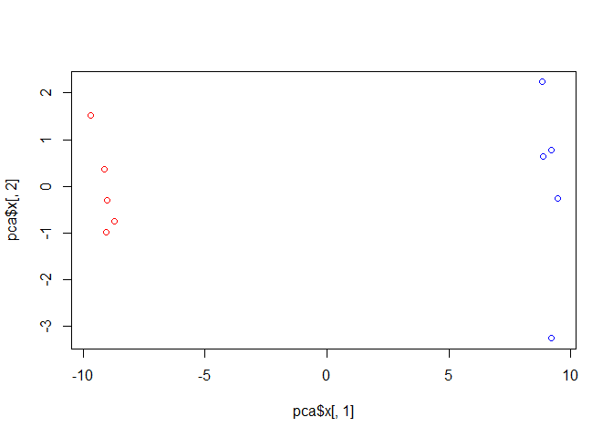
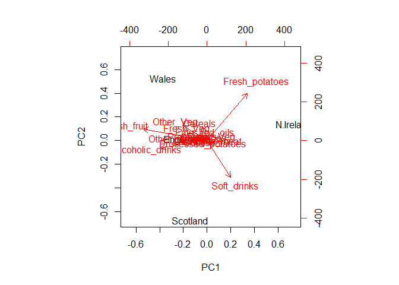

class08
================
Chris
10/24/2019

## K-means clustering

``` r
# Generate some example data for clustering
tmp <- c(rnorm(30,-3), rnorm(30,3))
x <- cbind(x=tmp, y=rev(tmp))
plot(x)
```

<!-- -->

Use kmeans () function setting k = 2 and nstart = 20

``` r
k <- kmeans(x, centers = 2, nstart = 20)
```

inspect/print results

``` r
k
```

    ## K-means clustering with 2 clusters of sizes 30, 30
    ## 
    ## Cluster means:
    ##           x         y
    ## 1  3.294016 -3.354044
    ## 2 -3.354044  3.294016
    ## 
    ## Clustering vector:
    ##  [1] 2 2 2 2 2 2 2 2 2 2 2 2 2 2 2 2 2 2 2 2 2 2 2 2 2 2 2 2 2 2 1 1 1 1 1
    ## [36] 1 1 1 1 1 1 1 1 1 1 1 1 1 1 1 1 1 1 1 1 1 1 1 1 1
    ## 
    ## Within cluster sum of squares by cluster:
    ## [1] 71.97094 71.97094
    ##  (between_SS / total_SS =  90.2 %)
    ## 
    ## Available components:
    ## 
    ## [1] "cluster"      "centers"      "totss"        "withinss"    
    ## [5] "tot.withinss" "betweenss"    "size"         "iter"        
    ## [9] "ifault"

``` r
k$size
```

    ## [1] 30 30

``` r
k$cluster
```

    ##  [1] 2 2 2 2 2 2 2 2 2 2 2 2 2 2 2 2 2 2 2 2 2 2 2 2 2 2 2 2 2 2 1 1 1 1 1
    ## [36] 1 1 1 1 1 1 1 1 1 1 1 1 1 1 1 1 1 1 1 1 1 1 1 1 1

``` r
k$centers
```

    ##           x         y
    ## 1  3.294016 -3.354044
    ## 2 -3.354044  3.294016

plot x colored by kmeans

``` r
plot(x, col= k$cluster)
points(k$centers, col = "blue", pch = 15)
```

<!-- -->

## Hierarchical clustering in R

The hclust() function requires a distance matrix as input. You can get
this from ‘dist()’ function

``` r
# First we need to calculate point (dis)similarity
# as the Euclidean distance between observations
dist_matrix <- dist(x)

# The hclust() function returns a hierarchical
# clustering model
hc <- hclust(d = dist_matrix)

# the print method is not so useful here
hc 
```

    ## 
    ## Call:
    ## hclust(d = dist_matrix)
    ## 
    ## Cluster method   : complete 
    ## Distance         : euclidean 
    ## Number of objects: 60

``` r
plot(hc)
# Draws a dendrogram
plot(hc)
abline(h=6, col="red")
```

<!-- -->

``` r
grps <- cutree(hc, h = 6)
```

``` r
cutree(hc, k = 2)
```

    ##  [1] 1 1 1 1 1 1 1 1 1 1 1 1 1 1 1 1 1 1 1 1 1 1 1 1 1 1 1 1 1 1 2 2 2 2 2
    ## [36] 2 2 2 2 2 2 2 2 2 2 2 2 2 2 2 2 2 2 2 2 2 2 2 2 2

``` r
# Step 1. Generate some example data for clustering
x <- rbind(
 matrix(rnorm(100, mean=0, sd = 0.3), ncol = 2), # c1
 matrix(rnorm(100, mean = 1, sd = 0.3), ncol = 2), # c2
 matrix(c(rnorm(50, mean = 1, sd = 0.3), # c3
 rnorm(50, mean = 0, sd = 0.3)), ncol = 2))
colnames(x) <- c("x", "y")

# Step 2. Plot the data without clustering
plot(x)
```

<!-- -->

``` r
# Step 3. Generate colors for known clusters
# (just so we can compare to hclust results)
col <- as.factor( rep(c("c1","c2","c3"), each=50) )
plot(x, col=col)
```

<!-- -->

``` r
kmeans(x, centers = 3, nstart = 20)
```

    ## K-means clustering with 3 clusters of sizes 50, 53, 47
    ## 
    ## Cluster means:
    ##            x            y
    ## 1 0.92897746 -0.121776203
    ## 2 1.01909032  1.010522914
    ## 3 0.01548008  0.001232643
    ## 
    ## Clustering vector:
    ##   [1] 1 3 3 3 3 3 3 3 3 3 3 3 3 3 3 3 1 1 3 3 3 3 3 3 3 3 3 3 3 3 3 3 3 3 3
    ##  [36] 3 3 3 3 3 3 3 1 3 3 3 3 3 3 1 2 2 2 2 2 2 2 2 2 2 2 2 2 2 2 2 2 2 2 2
    ##  [71] 2 2 2 2 2 2 2 2 2 2 2 2 2 2 2 2 2 2 2 2 2 2 2 2 2 2 2 2 2 2 1 1 1 3 1
    ## [106] 1 1 1 1 1 1 1 2 1 1 1 1 1 1 1 1 1 1 1 2 1 1 1 1 1 1 1 1 3 1 1 1 1 1 1
    ## [141] 1 1 1 1 1 1 1 1 2 1
    ## 
    ## Within cluster sum of squares by cluster:
    ## [1] 8.161081 8.150538 7.620478
    ##  (between_SS / total_SS =  74.5 %)
    ## 
    ## Available components:
    ## 
    ## [1] "cluster"      "centers"      "totss"        "withinss"    
    ## [5] "tot.withinss" "betweenss"    "size"         "iter"        
    ## [9] "ifault"

``` r
#clustering
h <- hclust(dist(x))

#draw tree
plot(h)
abline(h = 2, col = "red")
```

<!-- -->

``` r
#cut the tree into clusters/groups
grp <-cutree(h, k = 3)
```

plot data colored by hclust

``` r
plot(x, col = grp)
```

<!-- -->

``` r
# how many points in each cluster
table(grp)
```

    ## grp
    ##  1  2  3 
    ## 61 30 59

cross-tabulate compare clustering result with the known answer

``` r
table(grp, col)
```

    ##    col
    ## grp c1 c2 c3
    ##   1 17  0 44
    ##   2 29  0  1
    ##   3  4 50  5

``` r
## You can also download this file from the class website!
mydata <- read.csv("https://tinyurl.com/expression-CSV",
 row.names=1)

head(mydata)
```

    ##        wt1 wt2  wt3  wt4 wt5 ko1 ko2 ko3 ko4 ko5
    ## gene1  439 458  408  429 420  90  88  86  90  93
    ## gene2  219 200  204  210 187 427 423 434 433 426
    ## gene3 1006 989 1030 1017 973 252 237 238 226 210
    ## gene4  783 792  829  856 760 849 856 835 885 894
    ## gene5  181 249  204  244 225 277 305 272 270 279
    ## gene6  460 502  491  491 493 612 594 577 618 638

``` r
dim(mydata)
```

    ## [1] 100  10

``` r
## lets do PCA with prcomp()
pca <- prcomp(t(mydata), scale=TRUE) 

## See what is returned by the prcomp() function
attributes(pca) 
```

    ## $names
    ## [1] "sdev"     "rotation" "center"   "scale"    "x"       
    ## 
    ## $class
    ## [1] "prcomp"

``` r
pca$x
```

    ##           PC1        PC2        PC3        PC4        PC5        PC6
    ## wt1 -9.697374  1.5233313 -0.2753567  0.7322391 -0.6749398 -1.1823860
    ## wt2 -9.138950  0.3748504  1.0867958 -1.9461655  0.7571209  0.4369228
    ## wt3 -9.054263 -0.9855163  0.4152966  1.4166028  0.5835918 -0.6937236
    ## wt4 -8.731483 -0.7468371  0.5875748  0.2268129 -1.5404775  1.2723618
    ## wt5 -9.006312 -0.2945307 -1.8498101 -0.4303812  0.8666124  0.2496025
    ## ko1  8.846999  2.2345475 -0.1462750 -1.1544333 -0.6947862 -0.7128021
    ## ko2  9.213885 -3.2607503  0.2287292 -0.7658122 -0.4922849 -0.9170241
    ## ko3  9.458412 -0.2636283 -1.5778183  0.2433549  0.3654124  0.5837724
    ## ko4  8.883412  0.6339701  1.5205064  0.7760158  1.2158376  0.1446094
    ## ko5  9.225673  0.7845635  0.0103574  0.9017667 -0.3860869  0.8186668
    ##             PC7         PC8         PC9         PC10
    ## wt1  0.24446614  1.03519396  0.07010231 3.691492e-15
    ## wt2  0.03275370  0.26622249  0.72780448 3.080869e-15
    ## wt3  0.03578383 -1.05851494  0.52979799 2.595146e-15
    ## wt4  0.52795595 -0.20995085 -0.50325679 3.122502e-15
    ## wt5 -0.83227047 -0.05891489 -0.81258430 3.302913e-15
    ## ko1  0.07864392 -0.94652648 -0.24613776 3.351486e-15
    ## ko2 -0.30945771  0.33231138 -0.08786782 2.629841e-15
    ## ko3  1.43723425  0.14495188  0.56617746 3.094747e-15
    ## ko4  0.35073859  0.30381920 -0.87353886 2.983724e-15
    ## ko5 -1.56584821  0.19140827  0.62950330 3.233525e-15

``` r
## A basic PC1 vs PC2 2-D plot
plot(pca$x[,1], pca$x[,2]) 
```

<!-- -->

``` r
## Precent variance is often more informative to look at
pca.var <- pca$sdev^2
pca.var.per <- round(pca.var/sum(pca.var)*100, 1)
pca.var.per
```

    ##  [1] 92.6  2.3  1.1  1.1  0.8  0.7  0.6  0.4  0.4  0.0

``` r
#Scree Plot
barplot(pca.var.per, main="Scree Plot",
 xlab="Principal Component", ylab="Percent Variation")
```

<!-- -->

``` r
plot(pca$x[,1], pca$x[,2],
     col = c("red", "red", "red", "red", "red",
             "blue", "blue", "blue", "blue", "blue"))
```

<!-- -->

``` r
x <- read.csv("UK_foods.csv", row.names = 1)
dim(x)
```

    ## [1] 17  4

``` r
head(x)
```

    ##                England Wales Scotland N.Ireland
    ## Cheese             105   103      103        66
    ## Carcass_meat       245   227      242       267
    ## Other_meat         685   803      750       586
    ## Fish               147   160      122        93
    ## Fats_and_oils      193   235      184       209
    ## Sugars             156   175      147       139

``` r
barplot(as.matrix(x), beside=T, col=rainbow(nrow(x)))
```

<!-- -->

``` r
pairs(x, col=rainbow(10), pch=16)
```

<!-- -->

``` r
pca <- prcomp(t(x))
summary(pca)
```

    ## Importance of components:
    ##                             PC1      PC2      PC3       PC4
    ## Standard deviation     324.1502 212.7478 73.87622 4.189e-14
    ## Proportion of Variance   0.6744   0.2905  0.03503 0.000e+00
    ## Cumulative Proportion    0.6744   0.9650  1.00000 1.000e+00

``` r
# Plot PC1 vs PC2
plot(pca$x[,1], pca$x[,2], xlab="PC1", ylab="PC2", xlim=c(-270,500))
text(pca$x[,1], pca$x[,2], colnames(x), col = c("yellow", "red", "blue", "green" ))
```

<!-- -->

``` r
v <- round( pca$sdev^2/sum(pca$sdev^2) * 100 )
v
```

    ## [1] 67 29  4  0

``` r
barplot(v, xlab="Principal Component", ylab="Percent Variation")
```

<!-- -->

``` r
## Lets focus on PC1 as it accounts for > 90% of variance 
par(mar=c(10, 3, 0.35, 0))
barplot( pca$rotation[,1], las=2 )
```

<!-- -->

``` r
par(mar=c(10, 3, 0.35, 0))
barplot( pca$rotation[,2], las=2 )
```

<!-- -->

``` r
## The inbuilt biplot() can be useful for small datasets 
biplot(pca)
```

<!-- -->
