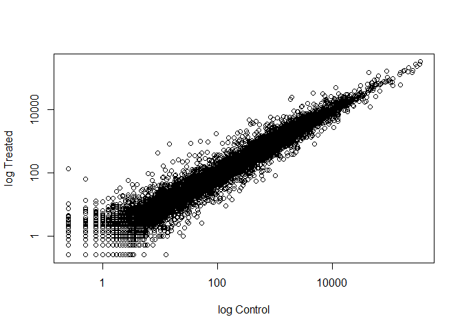
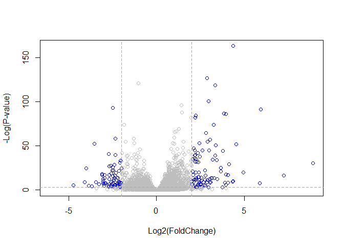
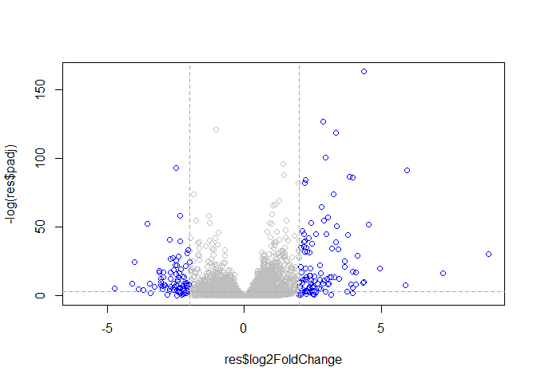

Class 14: Transcriptomics and the Analysis of RNA-Seq Data
================

## DESeq2 setup

We will use the DESeq2 package from bioconductor. To install this we ran
**in the CONSOLE** - note eval=FALSE option:

``` r
## install.packages("BiocManager")
## BiocManager::install()

##For this class, you'll also need DESeq2:
## BiocManager::install("DESeq2")
```

## Input dataset

Input countData and colData (metadata)

``` r
counts <- read.csv("airway_scaledcounts.csv", stringsAsFactors = FALSE)
metadata <- read.csv("airway_metadata.csv", stringsAsFactors = FALSE)
```

Have a peek…

``` r
head(counts)
```

    ##           ensgene SRR1039508 SRR1039509 SRR1039512 SRR1039513 SRR1039516
    ## 1 ENSG00000000003        723        486        904        445       1170
    ## 2 ENSG00000000005          0          0          0          0          0
    ## 3 ENSG00000000419        467        523        616        371        582
    ## 4 ENSG00000000457        347        258        364        237        318
    ## 5 ENSG00000000460         96         81         73         66        118
    ## 6 ENSG00000000938          0          0          1          0          2
    ##   SRR1039517 SRR1039520 SRR1039521
    ## 1       1097        806        604
    ## 2          0          0          0
    ## 3        781        417        509
    ## 4        447        330        324
    ## 5         94        102         74
    ## 6          0          0          0

``` r
head(metadata)
```

    ##           id     dex celltype     geo_id
    ## 1 SRR1039508 control   N61311 GSM1275862
    ## 2 SRR1039509 treated   N61311 GSM1275863
    ## 3 SRR1039512 control  N052611 GSM1275866
    ## 4 SRR1039513 treated  N052611 GSM1275867
    ## 5 SRR1039516 control  N080611 GSM1275870
    ## 6 SRR1039517 treated  N080611 GSM1275871

How many genes do we have in this dataset?

``` r
nrow(counts)
```

    ## [1] 38694

How many experiments do we have?

``` r
ncol(counts)
```

    ## [1] 9

Actually minus one since the column includes the ensemble gene id

``` r
nrow(metadata)
```

    ## [1] 8

``` r
View(metadata)
```

We want to know if there is a difference in expression values for
control(non-drug) vs treated(i.e. drug added cell lines)

First step is to find which experiments were the control experiments and
get the average values across all control experiments. Then we will do
the same for drug treated

``` r
control <- metadata[metadata[,"dex"]=="control",]
control$id
```

    ## [1] "SRR1039508" "SRR1039512" "SRR1039516" "SRR1039520"

Now calculate the mean values across these control columns of
**countdata**

``` r
control.mean <- rowSums(counts[ ,control$id]/length(control$id))
names(control.mean) <- counts$ensgene
```

Let’s do the same for drug treated

``` r
treated <- metadata[metadata[,"dex"] =="treated",]
treated$id
```

    ## [1] "SRR1039509" "SRR1039513" "SRR1039517" "SRR1039521"

``` r
treated.mean <- rowSums(counts[ ,treated$id]/length(treated$id))
names(treated.mean) <-counts$ensgene
```

We will combine our meancount data for bookkeeping purposes.

``` r
meancounts <- data.frame(control.mean, treated.mean)
```

Plot controlmean vs treated.mean

``` r
plot(meancounts$control.mean, meancounts$treated.mean, xlab = "Control", ylab = "Treated")
```

<!-- -->

``` r
plot(meancounts$control.mean, meancounts$treated.mean, log = "xy", xlab = "log Control", ylab = "log Treated" )
```

    ## Warning in xy.coords(x, y, xlabel, ylabel, log): 15032 x values <= 0
    ## omitted from logarithmic plot

    ## Warning in xy.coords(x, y, xlabel, ylabel, log): 15281 y values <= 0
    ## omitted from logarithmic plot

<!-- -->

We can find candidate differentially expressed genes by looking for
genes with a large change between control and dex-treated samples. We
usually look at the log2 of the fold change, because this has better
mathematical properties.

Here we calculate log2foldchange, add it to our meancounts data.frame
and inspect the results either with the head() or the View() function
for example.

``` r
meancounts$log2fc <- log2(meancounts[,"treated.mean"]/meancounts[,"control.mean"])
head(meancounts)
```

    ##                 control.mean treated.mean      log2fc
    ## ENSG00000000003       900.75       658.00 -0.45303916
    ## ENSG00000000005         0.00         0.00         NaN
    ## ENSG00000000419       520.50       546.00  0.06900279
    ## ENSG00000000457       339.75       316.50 -0.10226805
    ## ENSG00000000460        97.25        78.75 -0.30441833
    ## ENSG00000000938         0.75         0.00        -Inf

``` r
zero.vals <- which(meancounts[,1:2]==0, arr.ind=TRUE)

to.rm <- unique(zero.vals[,1])
mycounts <- meancounts[-to.rm,]
head(mycounts)
```

    ##                 control.mean treated.mean      log2fc
    ## ENSG00000000003       900.75       658.00 -0.45303916
    ## ENSG00000000419       520.50       546.00  0.06900279
    ## ENSG00000000457       339.75       316.50 -0.10226805
    ## ENSG00000000460        97.25        78.75 -0.30441833
    ## ENSG00000000971      5219.00      6687.50  0.35769358
    ## ENSG00000001036      2327.00      1785.75 -0.38194109

``` r
up.ind <- mycounts$log2fc > 2
down.ind <- mycounts$log2fc < (-2)
```

``` r
sum(up.ind)
```

    ## [1] 250

``` r
sum(down.ind)
```

    ## [1] 367

``` r
head(mycounts[up.ind,])
```

    ##                 control.mean treated.mean   log2fc
    ## ENSG00000004799       270.50      1429.25 2.401558
    ## ENSG00000006788         2.75        19.75 2.844349
    ## ENSG00000008438         0.50         2.75 2.459432
    ## ENSG00000011677         0.50         2.25 2.169925
    ## ENSG00000015413         0.50         3.00 2.584963
    ## ENSG00000015592         0.50         2.25 2.169925

``` r
head(mycounts[down.ind,])
```

    ##                 control.mean treated.mean    log2fc
    ## ENSG00000015520        32.00         6.00 -2.415037
    ## ENSG00000019186        26.50         1.75 -3.920566
    ## ENSG00000025423       295.00        54.25 -2.443020
    ## ENSG00000028277        88.25        22.00 -2.004093
    ## ENSG00000029559         1.25         0.25 -2.321928
    ## ENSG00000049246       405.00        93.00 -2.122619

``` r
anno <- read.csv("annotables_grch38.csv")
head(anno)
```

    ##           ensgene entrez   symbol chr     start       end strand
    ## 1 ENSG00000000003   7105   TSPAN6   X 100627109 100639991     -1
    ## 2 ENSG00000000005  64102     TNMD   X 100584802 100599885      1
    ## 3 ENSG00000000419   8813     DPM1  20  50934867  50958555     -1
    ## 4 ENSG00000000457  57147    SCYL3   1 169849631 169894267     -1
    ## 5 ENSG00000000460  55732 C1orf112   1 169662007 169854080      1
    ## 6 ENSG00000000938   2268      FGR   1  27612064  27635277     -1
    ##          biotype
    ## 1 protein_coding
    ## 2 protein_coding
    ## 3 protein_coding
    ## 4 protein_coding
    ## 5 protein_coding
    ## 6 protein_coding
    ##                                                                                                  description
    ## 1                                                          tetraspanin 6 [Source:HGNC Symbol;Acc:HGNC:11858]
    ## 2                                                            tenomodulin [Source:HGNC Symbol;Acc:HGNC:17757]
    ## 3 dolichyl-phosphate mannosyltransferase polypeptide 1, catalytic subunit [Source:HGNC Symbol;Acc:HGNC:3005]
    ## 4                                               SCY1-like, kinase-like 3 [Source:HGNC Symbol;Acc:HGNC:19285]
    ## 5                                    chromosome 1 open reading frame 112 [Source:HGNC Symbol;Acc:HGNC:25565]
    ## 6                          FGR proto-oncogene, Src family tyrosine kinase [Source:HGNC Symbol;Acc:HGNC:3697]

\#DESeq2 Analysis Let’s do this the right way. DESeq2 is an R package
for analyzing count-based NGS data like RNA-seq. It is available from
Bioconductor. Bioconductor is a project to provide tools for analyzing
high-throughput genomic data including RNA-seq, ChIP-seq and arrays.

``` r
library(DESeq2)
```

    ## Loading required package: S4Vectors

    ## Loading required package: stats4

    ## Loading required package: BiocGenerics

    ## Loading required package: parallel

    ## 
    ## Attaching package: 'BiocGenerics'

    ## The following objects are masked from 'package:parallel':
    ## 
    ##     clusterApply, clusterApplyLB, clusterCall, clusterEvalQ,
    ##     clusterExport, clusterMap, parApply, parCapply, parLapply,
    ##     parLapplyLB, parRapply, parSapply, parSapplyLB

    ## The following objects are masked from 'package:stats':
    ## 
    ##     IQR, mad, sd, var, xtabs

    ## The following objects are masked from 'package:base':
    ## 
    ##     anyDuplicated, append, as.data.frame, basename, cbind,
    ##     colnames, dirname, do.call, duplicated, eval, evalq, Filter,
    ##     Find, get, grep, grepl, intersect, is.unsorted, lapply, Map,
    ##     mapply, match, mget, order, paste, pmax, pmax.int, pmin,
    ##     pmin.int, Position, rank, rbind, Reduce, rownames, sapply,
    ##     setdiff, sort, table, tapply, union, unique, unsplit, which,
    ##     which.max, which.min

    ## 
    ## Attaching package: 'S4Vectors'

    ## The following object is masked from 'package:base':
    ## 
    ##     expand.grid

    ## Loading required package: IRanges

    ## 
    ## Attaching package: 'IRanges'

    ## The following object is masked from 'package:grDevices':
    ## 
    ##     windows

    ## Loading required package: GenomicRanges

    ## Loading required package: GenomeInfoDb

    ## Loading required package: SummarizedExperiment

    ## Loading required package: Biobase

    ## Welcome to Bioconductor
    ## 
    ##     Vignettes contain introductory material; view with
    ##     'browseVignettes()'. To cite Bioconductor, see
    ##     'citation("Biobase")', and for packages 'citation("pkgname")'.

    ## Loading required package: DelayedArray

    ## Loading required package: matrixStats

    ## 
    ## Attaching package: 'matrixStats'

    ## The following objects are masked from 'package:Biobase':
    ## 
    ##     anyMissing, rowMedians

    ## Loading required package: BiocParallel

    ## 
    ## Attaching package: 'DelayedArray'

    ## The following objects are masked from 'package:matrixStats':
    ## 
    ##     colMaxs, colMins, colRanges, rowMaxs, rowMins, rowRanges

    ## The following objects are masked from 'package:base':
    ## 
    ##     aperm, apply, rowsum

We will use the DESeqDataSetFromMatrix() function to build the required
DESeqDataSet object and call it dds, short for our DESeqDataSet. If you
get a warning about “some variables in design formula are characters,
converting to factors” don’t worry about it. Take a look at the dds
object once you create it.

``` r
dds <- DESeqDataSetFromMatrix(countData=counts, 
                              colData=metadata, 
                              design=~dex, 
                              tidy=TRUE)
```

    ## converting counts to integer mode

    ## Warning in DESeqDataSet(se, design = design, ignoreRank): some variables in
    ## design formula are characters, converting to factors

``` r
dds
```

    ## class: DESeqDataSet 
    ## dim: 38694 8 
    ## metadata(1): version
    ## assays(1): counts
    ## rownames(38694): ENSG00000000003 ENSG00000000005 ...
    ##   ENSG00000283120 ENSG00000283123
    ## rowData names(0):
    ## colnames(8): SRR1039508 SRR1039509 ... SRR1039520 SRR1039521
    ## colData names(4): id dex celltype geo_id

Run DESeq2…

``` r
dds <- DESeq(dds)
```

    ## estimating size factors

    ## estimating dispersions

    ## gene-wise dispersion estimates

    ## mean-dispersion relationship

    ## final dispersion estimates

    ## fitting model and testing

Get the results

``` r
res <- results(dds)
res
```

    ## log2 fold change (MLE): dex treated vs control 
    ## Wald test p-value: dex treated vs control 
    ## DataFrame with 38694 rows and 6 columns
    ##                          baseMean     log2FoldChange             lfcSE
    ##                         <numeric>          <numeric>         <numeric>
    ## ENSG00000000003  747.194195359907 -0.350703020686589 0.168245681332903
    ## ENSG00000000005                 0                 NA                NA
    ## ENSG00000000419  520.134160051965  0.206107766417874 0.101059218008481
    ## ENSG00000000457  322.664843927049 0.0245269479387461 0.145145067649738
    ## ENSG00000000460   87.682625164828 -0.147142049222083 0.257007253995456
    ## ...                           ...                ...               ...
    ## ENSG00000283115                 0                 NA                NA
    ## ENSG00000283116                 0                 NA                NA
    ## ENSG00000283119                 0                 NA                NA
    ## ENSG00000283120 0.974916032393564 -0.668258460516795  1.69456285242458
    ## ENSG00000283123                 0                 NA                NA
    ##                               stat             pvalue              padj
    ##                          <numeric>          <numeric>         <numeric>
    ## ENSG00000000003  -2.08446967499072 0.0371174658436988 0.163034808643509
    ## ENSG00000000005                 NA                 NA                NA
    ## ENSG00000000419   2.03947517583776 0.0414026263009679  0.17603166488093
    ## ENSG00000000457  0.168982303952169  0.865810560624016 0.961694238404893
    ## ENSG00000000460 -0.572520996721302  0.566969065259218  0.81584858763974
    ## ...                            ...                ...               ...
    ## ENSG00000283115                 NA                 NA                NA
    ## ENSG00000283116                 NA                 NA                NA
    ## ENSG00000283119                 NA                 NA                NA
    ## ENSG00000283120 -0.394354484733718  0.693319342567684                NA
    ## ENSG00000283123                 NA                 NA                NA

# SUmmary plot: a.k.a Volcano Plot

This figure will combine both fold change and the p-value into one
overview figure

``` r
res$sig <- res$padj<0.05 & abs(res$log2FoldChange)>2

# How many of each?
table(res$sig)
```

    ## 
    ## FALSE  TRUE 
    ## 24282   167

``` r
sum(is.na(res$sig))
```

    ## [1] 14245

``` r
# Set the color palette for our plot
palette( c("gray","blue") )

plot( res$log2FoldChange,  -log(res$padj), 
 col=res$sig+1, ylab="-Log(P-value)", xlab="Log2(FoldChange)")

# Add some cut-off lines
abline(v=c(-2,2), col="darkgray", lty=2)
abline(h=-log(0.05), col="darkgray", lty=2)
```

<!-- -->

``` r
#add some color please
mycols <-rep("gray", nrow(res))

#make points with +2 -2 fold change blue
mycols[abs(res$log2FoldChange) >2] <- "blue"
#make p-values < 0.05 gray
mycols[-log(res$padj) <0.05] <- "gray"

plot( res$log2FoldChange,  -log(res$padj), col= mycols)
abline(v=c(-2,2), col="darkgray", lty=2)
abline(h=-log(0.05), col="darkgray", lty=2)
```

<!-- -->

``` r
# Setup our custom point color vector 
mycols <- rep("gray", nrow(res))
mycols[ abs(res$log2FoldChange) > 2 ]  <- "red" 

inds <- (res$padj < 0.01) & (abs(res$log2FoldChange) > 2 )
mycols[ inds ] <- "blue"

#Volcano plot with custom colors 
plot( res$log2FoldChange,  -log(res$padj), 
 col=mycols, ylab="-Log(P-value)", xlab="Log2(FoldChange)" )

abline(v=c(-2,2), col="gray", lty=2)
abline(h=-log(0.1), col="gray", lty=2)
```

<!-- -->

``` r
write.csv(res, file = "expression_results.csv")
```
