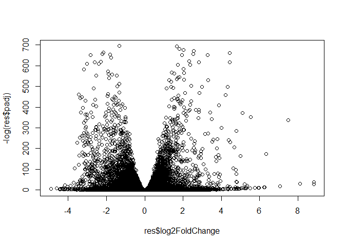

Class 15: Pathway Analysis from RNA-Seq Results
================

## Trapnell C, Hendrickson DG, Sauvageau M, Goff L et al. “Differential analysis of gene regulation at transcript resolution with RNA-seq”. Nat Biotechnol 2013 Jan;31(1):46-53. PMID: 23222703

## Import count and metadata

``` r
library(DESeq2)
```

    ## Loading required package: S4Vectors

    ## Loading required package: stats4

    ## Loading required package: BiocGenerics

    ## Loading required package: parallel

    ## 
    ## Attaching package: 'BiocGenerics'

    ## The following objects are masked from 'package:parallel':
    ## 
    ##     clusterApply, clusterApplyLB, clusterCall, clusterEvalQ,
    ##     clusterExport, clusterMap, parApply, parCapply, parLapply,
    ##     parLapplyLB, parRapply, parSapply, parSapplyLB

    ## The following objects are masked from 'package:stats':
    ## 
    ##     IQR, mad, sd, var, xtabs

    ## The following objects are masked from 'package:base':
    ## 
    ##     anyDuplicated, append, as.data.frame, basename, cbind,
    ##     colnames, dirname, do.call, duplicated, eval, evalq, Filter,
    ##     Find, get, grep, grepl, intersect, is.unsorted, lapply, Map,
    ##     mapply, match, mget, order, paste, pmax, pmax.int, pmin,
    ##     pmin.int, Position, rank, rbind, Reduce, rownames, sapply,
    ##     setdiff, sort, table, tapply, union, unique, unsplit, which,
    ##     which.max, which.min

    ## 
    ## Attaching package: 'S4Vectors'

    ## The following object is masked from 'package:base':
    ## 
    ##     expand.grid

    ## Loading required package: IRanges

    ## 
    ## Attaching package: 'IRanges'

    ## The following object is masked from 'package:grDevices':
    ## 
    ##     windows

    ## Loading required package: GenomicRanges

    ## Loading required package: GenomeInfoDb

    ## Loading required package: SummarizedExperiment

    ## Loading required package: Biobase

    ## Welcome to Bioconductor
    ## 
    ##     Vignettes contain introductory material; view with
    ##     'browseVignettes()'. To cite Bioconductor, see
    ##     'citation("Biobase")', and for packages 'citation("pkgname")'.

    ## Loading required package: DelayedArray

    ## Loading required package: matrixStats

    ## 
    ## Attaching package: 'matrixStats'

    ## The following objects are masked from 'package:Biobase':
    ## 
    ##     anyMissing, rowMedians

    ## Loading required package: BiocParallel

    ## 
    ## Attaching package: 'DelayedArray'

    ## The following objects are masked from 'package:matrixStats':
    ## 
    ##     colMaxs, colMins, colRanges, rowMaxs, rowMins, rowRanges

    ## The following objects are masked from 'package:base':
    ## 
    ##     aperm, apply, rowsum

``` r
metaFile <- read.csv("GSE37704_metadata.csv")
countFile <- read.csv("GSE37704_featurecounts.csv")

# Import metadata and take a peak
colData = read.csv("GSE37704_metadata.csv", row.names=1)
head(colData)
```

    ##               condition
    ## SRR493366 control_sirna
    ## SRR493367 control_sirna
    ## SRR493368 control_sirna
    ## SRR493369      hoxa1_kd
    ## SRR493370      hoxa1_kd
    ## SRR493371      hoxa1_kd

``` r
# Import countdata
countData = read.csv("GSE37704_featurecounts.csv", row.names=1)
head(countData)
```

    ##                 length SRR493366 SRR493367 SRR493368 SRR493369 SRR493370
    ## ENSG00000186092    918         0         0         0         0         0
    ## ENSG00000279928    718         0         0         0         0         0
    ## ENSG00000279457   1982        23        28        29        29        28
    ## ENSG00000278566    939         0         0         0         0         0
    ## ENSG00000273547    939         0         0         0         0         0
    ## ENSG00000187634   3214       124       123       205       207       212
    ##                 SRR493371
    ## ENSG00000186092         0
    ## ENSG00000279928         0
    ## ENSG00000279457        46
    ## ENSG00000278566         0
    ## ENSG00000273547         0
    ## ENSG00000187634       258

``` r
# Note we need to remove the odd first $length col
countData <- as.matrix(countData[,-1])
head(countData)
```

    ##                 SRR493366 SRR493367 SRR493368 SRR493369 SRR493370
    ## ENSG00000186092         0         0         0         0         0
    ## ENSG00000279928         0         0         0         0         0
    ## ENSG00000279457        23        28        29        29        28
    ## ENSG00000278566         0         0         0         0         0
    ## ENSG00000273547         0         0         0         0         0
    ## ENSG00000187634       124       123       205       207       212
    ##                 SRR493371
    ## ENSG00000186092         0
    ## ENSG00000279928         0
    ## ENSG00000279457        46
    ## ENSG00000278566         0
    ## ENSG00000273547         0
    ## ENSG00000187634       258

``` r
colnames(countData)
```

    ## [1] "SRR493366" "SRR493367" "SRR493368" "SRR493369" "SRR493370" "SRR493371"

``` r
rownames(colData)
```

    ## [1] "SRR493366" "SRR493367" "SRR493368" "SRR493369" "SRR493370" "SRR493371"

``` r
all(colnames(countData) == rownames(colData))
```

    ## [1] TRUE

``` r
# Test how the all function works
all(c(T,F,T))
```

    ## [1] FALSE

## Remove zero count genes

Remove genes with 0 count values in all experiments (rows that have all
0 across all columns)

``` r
#Filter out 0 count genes
countData = countData[rowSums(countData) != 0, ]
head(countData)
```

    ##                 SRR493366 SRR493367 SRR493368 SRR493369 SRR493370
    ## ENSG00000279457        23        28        29        29        28
    ## ENSG00000187634       124       123       205       207       212
    ## ENSG00000188976      1637      1831      2383      1226      1326
    ## ENSG00000187961       120       153       180       236       255
    ## ENSG00000187583        24        48        65        44        48
    ## ENSG00000187642         4         9        16        14        16
    ##                 SRR493371
    ## ENSG00000279457        46
    ## ENSG00000187634       258
    ## ENSG00000188976      1504
    ## ENSG00000187961       357
    ## ENSG00000187583        64
    ## ENSG00000187642        16

## DESeq analysis

``` r
#Setup object with data in the way DESeq wants it
dds = DESeqDataSetFromMatrix(countData=countData,
                             colData=colData,
                            design=~condition)
#Run the analysis
dds = DESeq(dds)
```

    ## estimating size factors

    ## estimating dispersions

    ## gene-wise dispersion estimates

    ## mean-dispersion relationship

    ## final dispersion estimates

    ## fitting model and testing

Get our results

``` r
res = results(dds)
res
```

    ## log2 fold change (MLE): condition hoxa1 kd vs control sirna 
    ## Wald test p-value: condition hoxa1 kd vs control sirna 
    ## DataFrame with 15975 rows and 6 columns
    ##                         baseMean     log2FoldChange              lfcSE
    ##                        <numeric>          <numeric>          <numeric>
    ## ENSG00000279457 29.9135794276176   0.17925708367269  0.324821565250145
    ## ENSG00000187634 183.229649921658  0.426457118403306  0.140265820376892
    ## ENSG00000188976 1651.18807619944 -0.692720464846366 0.0548465415913946
    ## ENSG00000187961 209.637938486147  0.729755610585225  0.131859899969345
    ## ENSG00000187583 47.2551232589398 0.0405765278756312  0.271892808601774
    ## ...                          ...                ...                ...
    ## ENSG00000273748 35.3026523877463  0.674387102558605  0.303666187454139
    ## ENSG00000278817 2.42302393023632 -0.388988266500022   1.13039377720313
    ## ENSG00000278384 1.10179649846993  0.332990658240634    1.6602614216556
    ## ENSG00000276345 73.6449563127136 -0.356180759105173   0.20771565839825
    ## ENSG00000271254 181.595902546813 -0.609666545167282  0.141320482803512
    ##                               stat               pvalue
    ##                          <numeric>            <numeric>
    ## ENSG00000279457  0.551863246932648    0.581042050747032
    ## ENSG00000187634   3.04034951107421  0.00236303749730996
    ## ENSG00000188976  -12.6301576133481 1.43989540156582e-36
    ## ENSG00000187961   5.53432552849563  3.1242824807768e-08
    ## ENSG00000187583  0.149237223611387    0.881366448669148
    ## ...                            ...                  ...
    ## ENSG00000273748   2.22081723425481    0.026363342804782
    ## ENSG00000278817 -0.344117487502873    0.730757932009185
    ## ENSG00000278384  0.200565196478864    0.841038574220432
    ## ENSG00000276345  -1.71475160732598   0.0863907773559434
    ## ENSG00000271254  -4.31407063627813 1.60275699407084e-05
    ##                                 padj
    ##                            <numeric>
    ## ENSG00000279457      0.6865547778329
    ## ENSG00000187634  0.00515718149494361
    ## ENSG00000188976  1.7654890539332e-35
    ## ENSG00000187961 1.13412993107607e-07
    ## ENSG00000187583    0.919030615571381
    ## ...                              ...
    ## ENSG00000273748   0.0479091179108357
    ## ENSG00000278817    0.809772069001658
    ## ENSG00000278384    0.892653531513564
    ## ENSG00000276345    0.139761501281218
    ## ENSG00000271254 4.53647639305091e-05

``` r
dds
```

    ## class: DESeqDataSet 
    ## dim: 15975 6 
    ## metadata(1): version
    ## assays(4): counts mu H cooks
    ## rownames(15975): ENSG00000279457 ENSG00000187634 ...
    ##   ENSG00000276345 ENSG00000271254
    ## rowData names(22): baseMean baseVar ... deviance maxCooks
    ## colnames(6): SRR493366 SRR493367 ... SRR493370 SRR493371
    ## colData names(2): condition sizeFactor

``` r
plot( res$log2FoldChange, -log(res$padj) )
```

<!-- -->

``` r
# Make a color vector for all genes
mycols <- rep("gray", nrow(res) )

# Color red the genes with absolute fold change above 2
mycols[ abs(res$log2FoldChange) > 2 ] <- "red"

# Color blue those with adjusted p-value less than 0.01
#  and absolute fold change more than 2
inds <- (res$padj) < 0.01 & (abs(res$log2FoldChange) > 2 )
mycols[ inds ] <- "blue"

plot( res$log2FoldChange, -log(res$padj), col = mycols, xlab="Log2(FoldChange)", ylab="-Log(P-value)" )
```

<!-- -->

\#\#Add gene symbols and entrez ids

``` r
##BiocManager::install("AnnotationDbi")
##BiocManager::install("org.Hs.eg.db")
```

``` r
library("AnnotationDbi")
library("org.Hs.eg.db")
```

    ## 

``` r
columns(org.Hs.eg.db)
```

    ##  [1] "ACCNUM"       "ALIAS"        "ENSEMBL"      "ENSEMBLPROT" 
    ##  [5] "ENSEMBLTRANS" "ENTREZID"     "ENZYME"       "EVIDENCE"    
    ##  [9] "EVIDENCEALL"  "GENENAME"     "GO"           "GOALL"       
    ## [13] "IPI"          "MAP"          "OMIM"         "ONTOLOGY"    
    ## [17] "ONTOLOGYALL"  "PATH"         "PFAM"         "PMID"        
    ## [21] "PROSITE"      "REFSEQ"       "SYMBOL"       "UCSCKG"      
    ## [25] "UNIGENE"      "UNIPROT"

``` r
res$symbol = mapIds(org.Hs.eg.db,
                    keys= row.names(countData), # Where are my IDs
                    keytype="ENSEMBL",          # What format are my IDs
                    column="SYMBOL",            # The new format I want
                    multiVals="first")
```

    ## 'select()' returned 1:many mapping between keys and columns

``` r
res$entrez = mapIds(org.Hs.eg.db,
                    keys= rownames(countData),
                    keytype="ENSEMBL",
                    column="ENTREZID",
                    multiVals="first")
```

    ## 'select()' returned 1:many mapping between keys and columns

``` r
res$name =   mapIds(org.Hs.eg.db,
                    keys=row.names(res),
                    keytype="ENSEMBL",
                    column="GENENAME",
                    multiVals="first")
```

    ## 'select()' returned 1:many mapping between keys and columns

``` r
head(res, 10)
```

    ## log2 fold change (MLE): condition hoxa1 kd vs control sirna 
    ## Wald test p-value: condition hoxa1 kd vs control sirna 
    ## DataFrame with 10 rows and 9 columns
    ##                          baseMean     log2FoldChange              lfcSE
    ##                         <numeric>          <numeric>          <numeric>
    ## ENSG00000279457  29.9135794276176   0.17925708367269  0.324821565250145
    ## ENSG00000187634  183.229649921658  0.426457118403306  0.140265820376892
    ## ENSG00000188976  1651.18807619944 -0.692720464846366 0.0548465415913946
    ## ENSG00000187961  209.637938486147  0.729755610585225  0.131859899969345
    ## ENSG00000187583  47.2551232589398 0.0405765278756312  0.271892808601774
    ## ENSG00000187642  11.9797501642461  0.542810491577363  0.521559849534146
    ## ENSG00000188290  108.922127976716    2.0570638345631  0.196905312993839
    ## ENSG00000187608   350.71686801731  0.257383686481771  0.102726560033541
    ## ENSG00000188157    9128.439421961  0.389908792022773 0.0467163395511376
    ## ENSG00000237330 0.158192358990472  0.785955208142751    4.0804728567969
    ##                              stat               pvalue
    ##                         <numeric>            <numeric>
    ## ENSG00000279457 0.551863246932648    0.581042050747032
    ## ENSG00000187634  3.04034951107421  0.00236303749730996
    ## ENSG00000188976 -12.6301576133481 1.43989540156582e-36
    ## ENSG00000187961  5.53432552849563  3.1242824807768e-08
    ## ENSG00000187583 0.149237223611387    0.881366448669148
    ## ENSG00000187642  1.04074439790984    0.297994191720983
    ## ENSG00000188290  10.4469696794188 1.51281875407629e-25
    ## ENSG00000187608  2.50552229528308   0.0122270689409846
    ## ENSG00000188157  8.34630443585938 7.04321148758242e-17
    ## ENSG00000237330 0.192613757210411    0.847261469988086
    ##                                 padj      symbol      entrez
    ##                            <numeric> <character> <character>
    ## ENSG00000279457      0.6865547778329          NA          NA
    ## ENSG00000187634  0.00515718149494361      SAMD11      148398
    ## ENSG00000188976  1.7654890539332e-35       NOC2L       26155
    ## ENSG00000187961 1.13412993107607e-07      KLHL17      339451
    ## ENSG00000187583    0.919030615571381     PLEKHN1       84069
    ## ENSG00000187642    0.403379309754068       PERM1       84808
    ## ENSG00000188290  1.3053818968136e-24        HES4       57801
    ## ENSG00000187608   0.0237452288907934       ISG15        9636
    ## ENSG00000188157 4.21962808552804e-16        AGRN      375790
    ## ENSG00000237330                   NA      RNF223      401934
    ##                                                                     name
    ##                                                              <character>
    ## ENSG00000279457                                                       NA
    ## ENSG00000187634                 sterile alpha motif domain containing 11
    ## ENSG00000188976 NOC2 like nucleolar associated transcriptional repressor
    ## ENSG00000187961                              kelch like family member 17
    ## ENSG00000187583                 pleckstrin homology domain containing N1
    ## ENSG00000187642             PPARGC1 and ESRR induced regulator, muscle 1
    ## ENSG00000188290                   hes family bHLH transcription factor 4
    ## ENSG00000187608                            ISG15 ubiquitin like modifier
    ## ENSG00000188157                                                    agrin
    ## ENSG00000237330                                  ring finger protein 223

## Pathway Analysis

Here we are going to use the gage package for pathway analysis. Once we
have a list of enriched pathways, we’re going to use the pathview
package to draw pathway diagrams, shading the molecules in the pathway
by their degree of up/down-regulation.

KEGG pathways The gageData package has pre-compiled databases mapping
genes to KEGG pathways and GO terms for common organisms. kegg.sets.hs
is a named list of 229 elements. Each element is a character vector of
member gene Entrez IDs for a single KEGG pathway. (See also go.sets.hs).
The sigmet.idx.hs is an index of numbers of signaling and metabolic
pathways in kegg.set.gs. In other words, KEGG pathway include other
types of pathway definitions, like “Global Map” and “Human Diseases”,
which may be undesirable in a particular pathway analysis. Therefore,
kegg.sets.hs\[sigmet.idx.hs\] gives you the “cleaner” gene sets of
signaling and metabolic pathways only.

Side-Note: While there are many freely available tools to do pathway
analysis, and some like gage are truly fantastic, many of them are
poorly maintained or rarely updated. The DAVID tool that a lot of folks
use for simple gene set enrichment analysis was not updated at all
between Jan 2010 and Oct 2016.

``` r
# Run in your R console (i.e. not your Rmarkdown doc!)
##BiocManager::install( c("pathview", "gage", "gageData") )

# For old vesrsions of R only (R < 3.5.0)!
#source("http://bioconductor.org/biocLite.R")
#biocLite( c("pathview", "gage", "gageData") )
```

``` r
library(pathview)
```

    ## ##############################################################################
    ## Pathview is an open source software package distributed under GNU General
    ## Public License version 3 (GPLv3). Details of GPLv3 is available at
    ## http://www.gnu.org/licenses/gpl-3.0.html. Particullary, users are required to
    ## formally cite the original Pathview paper (not just mention it) in publications
    ## or products. For details, do citation("pathview") within R.
    ## 
    ## The pathview downloads and uses KEGG data. Non-academic uses may require a KEGG
    ## license agreement (details at http://www.kegg.jp/kegg/legal.html).
    ## ##############################################################################

``` r
library(gage)
library(gageData)
```

``` r
data(kegg.sets.hs)
data(sigmet.idx.hs)

# Focus on signaling and metabolic pathways only
kegg.sets.hs = kegg.sets.hs[sigmet.idx.hs]

# Examine the first 3 pathways
head(kegg.sets.hs, 3)
```

    ## $`hsa00232 Caffeine metabolism`
    ## [1] "10"   "1544" "1548" "1549" "1553" "7498" "9"   
    ## 
    ## $`hsa00983 Drug metabolism - other enzymes`
    ##  [1] "10"     "1066"   "10720"  "10941"  "151531" "1548"   "1549"  
    ##  [8] "1551"   "1553"   "1576"   "1577"   "1806"   "1807"   "1890"  
    ## [15] "221223" "2990"   "3251"   "3614"   "3615"   "3704"   "51733" 
    ## [22] "54490"  "54575"  "54576"  "54577"  "54578"  "54579"  "54600" 
    ## [29] "54657"  "54658"  "54659"  "54963"  "574537" "64816"  "7083"  
    ## [36] "7084"   "7172"   "7363"   "7364"   "7365"   "7366"   "7367"  
    ## [43] "7371"   "7372"   "7378"   "7498"   "79799"  "83549"  "8824"  
    ## [50] "8833"   "9"      "978"   
    ## 
    ## $`hsa00230 Purine metabolism`
    ##   [1] "100"    "10201"  "10606"  "10621"  "10622"  "10623"  "107"   
    ##   [8] "10714"  "108"    "10846"  "109"    "111"    "11128"  "11164" 
    ##  [15] "112"    "113"    "114"    "115"    "122481" "122622" "124583"
    ##  [22] "132"    "158"    "159"    "1633"   "171568" "1716"   "196883"
    ##  [29] "203"    "204"    "205"    "221823" "2272"   "22978"  "23649" 
    ##  [36] "246721" "25885"  "2618"   "26289"  "270"    "271"    "27115" 
    ##  [43] "272"    "2766"   "2977"   "2982"   "2983"   "2984"   "2986"  
    ##  [50] "2987"   "29922"  "3000"   "30833"  "30834"  "318"    "3251"  
    ##  [57] "353"    "3614"   "3615"   "3704"   "377841" "471"    "4830"  
    ##  [64] "4831"   "4832"   "4833"   "4860"   "4881"   "4882"   "4907"  
    ##  [71] "50484"  "50940"  "51082"  "51251"  "51292"  "5136"   "5137"  
    ##  [78] "5138"   "5139"   "5140"   "5141"   "5142"   "5143"   "5144"  
    ##  [85] "5145"   "5146"   "5147"   "5148"   "5149"   "5150"   "5151"  
    ##  [92] "5152"   "5153"   "5158"   "5167"   "5169"   "51728"  "5198"  
    ##  [99] "5236"   "5313"   "5315"   "53343"  "54107"  "5422"   "5424"  
    ## [106] "5425"   "5426"   "5427"   "5430"   "5431"   "5432"   "5433"  
    ## [113] "5434"   "5435"   "5436"   "5437"   "5438"   "5439"   "5440"  
    ## [120] "5441"   "5471"   "548644" "55276"  "5557"   "5558"   "55703" 
    ## [127] "55811"  "55821"  "5631"   "5634"   "56655"  "56953"  "56985" 
    ## [134] "57804"  "58497"  "6240"   "6241"   "64425"  "646625" "654364"
    ## [141] "661"    "7498"   "8382"   "84172"  "84265"  "84284"  "84618" 
    ## [148] "8622"   "8654"   "87178"  "8833"   "9060"   "9061"   "93034" 
    ## [155] "953"    "9533"   "954"    "955"    "956"    "957"    "9583"  
    ## [162] "9615"

The main gage() function requires a named vector of fold changes, where
the names of the values are the Entrez gene IDs.

Note that we used the mapIDs() function above to obtain Entrez gene IDs
(stored in
res\(entrez) and we have the fold change results from DESeq2 analysis (stored in res\)log2FoldChange).

``` r
foldchanges = res$log2FoldChange
names(foldchanges) = res$entrez
head(foldchanges)
```

    ##        <NA>      148398       26155      339451       84069       84808 
    ##  0.17925708  0.42645712 -0.69272046  0.72975561  0.04057653  0.54281049

Now, let’s run the gage pathway analysis.

``` r
# Get the results
keggres = gage(foldchanges, gsets=kegg.sets.hs)
```

See help on the gage function with ?gage. Specifically, you might want
to try changing the value of same.dir. This value determines whether to
test for changes in a gene set toward a single direction (all genes up
or down regulated) or changes towards both directions simultaneously
(i.e. any genes in the pathway dysregulated). Here, we’re using the
default same.dir=TRUE, which will give us separate lists for pathways
that are upregulated versus pathways that are down-regulated.

Now lets look at the object returned from gage().

``` r
attributes(keggres)
```

    ## $names
    ## [1] "greater" "less"    "stats"

It is a list with three elements, “greater”, “less” and “stats”.

You can also see this in your Environmnet panel/tab window of RStudio or
use the R command str(keggres).

Like any list we can use the dollar syntax to access a named element,
e.g. head(keggres\(greater) and head(keggres\)less).

Lets look at the first few down (less) pathway results:

``` r
# Look at the first few down (less) pathways
head(keggres$less)
```

    ##                                          p.geomean stat.mean        p.val
    ## hsa04110 Cell cycle                   8.995727e-06 -4.378644 8.995727e-06
    ## hsa03030 DNA replication              9.424076e-05 -3.951803 9.424076e-05
    ## hsa03013 RNA transport                1.246882e-03 -3.059466 1.246882e-03
    ## hsa03440 Homologous recombination     3.066756e-03 -2.852899 3.066756e-03
    ## hsa04114 Oocyte meiosis               3.784520e-03 -2.698128 3.784520e-03
    ## hsa00010 Glycolysis / Gluconeogenesis 8.961413e-03 -2.405398 8.961413e-03
    ##                                             q.val set.size         exp1
    ## hsa04110 Cell cycle                   0.001448312      121 8.995727e-06
    ## hsa03030 DNA replication              0.007586381       36 9.424076e-05
    ## hsa03013 RNA transport                0.066915974      144 1.246882e-03
    ## hsa03440 Homologous recombination     0.121861535       28 3.066756e-03
    ## hsa04114 Oocyte meiosis               0.121861535      102 3.784520e-03
    ## hsa00010 Glycolysis / Gluconeogenesis 0.212222694       53 8.961413e-03

Each keggres\(less and keggres\)greater object is data matrix with gene
sets as rows sorted by p-value.

The top “less/down” pathways is “Cell cycle” with the KEGG pathway
identifier hsa04110.

Now, let’s try out the pathview() function from the pathview package to
make a pathway plot with our RNA-Seq expression results shown in color.
To begin with lets manually supply a pathway.id (namely the first part
of the “hsa04110 Cell cycle”) that we could see from the print out
above.

``` r
pathview(gene.data=foldchanges, pathway.id="hsa04110")
```

    ## 'select()' returned 1:1 mapping between keys and columns

    ## Info: Working in directory C:/Users/chris/OneDrive/Desktop/BIMM143_F19/bimm143github/class15

    ## Info: Writing image file hsa04110.pathview.png

This downloads the pathway figure data from KEGG and adds our results to
it. Here is the default low resolution raster PNG output from the
pathview() call above:

Note how many of the genes in this pathway are perturbed (i.e. colored)
in our results.

You can play with the other input arguments to pathview() to change the
display in various ways including generating a PDF graph. For example:

``` r
# A different PDF based output of the same data
pathview(gene.data=foldchanges, pathway.id="hsa04110", kegg.native=FALSE)
```

    ## 'select()' returned 1:1 mapping between keys and columns

    ## Info: Working in directory C:/Users/chris/OneDrive/Desktop/BIMM143_F19/bimm143github/class15

    ## Info: Writing image file hsa04110.pathview.pdf

Now, let’s process our results a bit more to automagicaly pull out the
top 5 upregulated pathways, then further process that just to get the
pathway IDs needed by the pathview() function. We’ll use these KEGG
pathway IDs for pathview plotting below.

``` r
## Focus on top 5 upregulated pathways here for demo purposes only
keggrespathways <- rownames(keggres$greater)[1:5]

# Extract the 8 character long IDs part of each string
keggresids = substr(keggrespathways, start=1, stop=8)
keggresids
```

    ## [1] "hsa04640" "hsa04630" "hsa00140" "hsa04142" "hsa04330"

Finally, lets pass these IDs in keggresids to the pathview() function to
draw plots for all the top 5 pathways.

``` r
pathview(gene.data=foldchanges, pathway.id=keggresids, species="hsa")
```

    ## 'select()' returned 1:1 mapping between keys and columns

    ## Info: Working in directory C:/Users/chris/OneDrive/Desktop/BIMM143_F19/bimm143github/class15

    ## Info: Writing image file hsa04640.pathview.png

    ## 'select()' returned 1:1 mapping between keys and columns

    ## Info: Working in directory C:/Users/chris/OneDrive/Desktop/BIMM143_F19/bimm143github/class15

    ## Info: Writing image file hsa04630.pathview.png

    ## Warning in structure(x$children, class = "XMLNodeList"): Calling 'structure(NULL, *)' is deprecated, as NULL cannot have attributes.
    ##   Consider 'structure(list(), *)' instead.
    
    ## Warning in structure(x$children, class = "XMLNodeList"): Calling 'structure(NULL, *)' is deprecated, as NULL cannot have attributes.
    ##   Consider 'structure(list(), *)' instead.
    
    ## Warning in structure(x$children, class = "XMLNodeList"): Calling 'structure(NULL, *)' is deprecated, as NULL cannot have attributes.
    ##   Consider 'structure(list(), *)' instead.
    
    ## Warning in structure(x$children, class = "XMLNodeList"): Calling 'structure(NULL, *)' is deprecated, as NULL cannot have attributes.
    ##   Consider 'structure(list(), *)' instead.
    
    ## Warning in structure(x$children, class = "XMLNodeList"): Calling 'structure(NULL, *)' is deprecated, as NULL cannot have attributes.
    ##   Consider 'structure(list(), *)' instead.
    
    ## Warning in structure(x$children, class = "XMLNodeList"): Calling 'structure(NULL, *)' is deprecated, as NULL cannot have attributes.
    ##   Consider 'structure(list(), *)' instead.
    
    ## Warning in structure(x$children, class = "XMLNodeList"): Calling 'structure(NULL, *)' is deprecated, as NULL cannot have attributes.
    ##   Consider 'structure(list(), *)' instead.
    
    ## Warning in structure(x$children, class = "XMLNodeList"): Calling 'structure(NULL, *)' is deprecated, as NULL cannot have attributes.
    ##   Consider 'structure(list(), *)' instead.
    
    ## Warning in structure(x$children, class = "XMLNodeList"): Calling 'structure(NULL, *)' is deprecated, as NULL cannot have attributes.
    ##   Consider 'structure(list(), *)' instead.
    
    ## Warning in structure(x$children, class = "XMLNodeList"): Calling 'structure(NULL, *)' is deprecated, as NULL cannot have attributes.
    ##   Consider 'structure(list(), *)' instead.
    
    ## Warning in structure(x$children, class = "XMLNodeList"): Calling 'structure(NULL, *)' is deprecated, as NULL cannot have attributes.
    ##   Consider 'structure(list(), *)' instead.
    
    ## Warning in structure(x$children, class = "XMLNodeList"): Calling 'structure(NULL, *)' is deprecated, as NULL cannot have attributes.
    ##   Consider 'structure(list(), *)' instead.
    
    ## Warning in structure(x$children, class = "XMLNodeList"): Calling 'structure(NULL, *)' is deprecated, as NULL cannot have attributes.
    ##   Consider 'structure(list(), *)' instead.
    
    ## Warning in structure(x$children, class = "XMLNodeList"): Calling 'structure(NULL, *)' is deprecated, as NULL cannot have attributes.
    ##   Consider 'structure(list(), *)' instead.
    
    ## Warning in structure(x$children, class = "XMLNodeList"): Calling 'structure(NULL, *)' is deprecated, as NULL cannot have attributes.
    ##   Consider 'structure(list(), *)' instead.
    
    ## Warning in structure(x$children, class = "XMLNodeList"): Calling 'structure(NULL, *)' is deprecated, as NULL cannot have attributes.
    ##   Consider 'structure(list(), *)' instead.
    
    ## Warning in structure(x$children, class = "XMLNodeList"): Calling 'structure(NULL, *)' is deprecated, as NULL cannot have attributes.
    ##   Consider 'structure(list(), *)' instead.
    
    ## Warning in structure(x$children, class = "XMLNodeList"): Calling 'structure(NULL, *)' is deprecated, as NULL cannot have attributes.
    ##   Consider 'structure(list(), *)' instead.
    
    ## Warning in structure(x$children, class = "XMLNodeList"): Calling 'structure(NULL, *)' is deprecated, as NULL cannot have attributes.
    ##   Consider 'structure(list(), *)' instead.
    
    ## Warning in structure(x$children, class = "XMLNodeList"): Calling 'structure(NULL, *)' is deprecated, as NULL cannot have attributes.
    ##   Consider 'structure(list(), *)' instead.
    
    ## Warning in structure(x$children, class = "XMLNodeList"): Calling 'structure(NULL, *)' is deprecated, as NULL cannot have attributes.
    ##   Consider 'structure(list(), *)' instead.
    
    ## Warning in structure(x$children, class = "XMLNodeList"): Calling 'structure(NULL, *)' is deprecated, as NULL cannot have attributes.
    ##   Consider 'structure(list(), *)' instead.
    
    ## Warning in structure(x$children, class = "XMLNodeList"): Calling 'structure(NULL, *)' is deprecated, as NULL cannot have attributes.
    ##   Consider 'structure(list(), *)' instead.
    
    ## Warning in structure(x$children, class = "XMLNodeList"): Calling 'structure(NULL, *)' is deprecated, as NULL cannot have attributes.
    ##   Consider 'structure(list(), *)' instead.
    
    ## Warning in structure(x$children, class = "XMLNodeList"): Calling 'structure(NULL, *)' is deprecated, as NULL cannot have attributes.
    ##   Consider 'structure(list(), *)' instead.
    
    ## Warning in structure(x$children, class = "XMLNodeList"): Calling 'structure(NULL, *)' is deprecated, as NULL cannot have attributes.
    ##   Consider 'structure(list(), *)' instead.
    
    ## Warning in structure(x$children, class = "XMLNodeList"): Calling 'structure(NULL, *)' is deprecated, as NULL cannot have attributes.
    ##   Consider 'structure(list(), *)' instead.
    
    ## Warning in structure(x$children, class = "XMLNodeList"): Calling 'structure(NULL, *)' is deprecated, as NULL cannot have attributes.
    ##   Consider 'structure(list(), *)' instead.
    
    ## Warning in structure(x$children, class = "XMLNodeList"): Calling 'structure(NULL, *)' is deprecated, as NULL cannot have attributes.
    ##   Consider 'structure(list(), *)' instead.
    
    ## Warning in structure(x$children, class = "XMLNodeList"): Calling 'structure(NULL, *)' is deprecated, as NULL cannot have attributes.
    ##   Consider 'structure(list(), *)' instead.
    
    ## Warning in structure(x$children, class = "XMLNodeList"): Calling 'structure(NULL, *)' is deprecated, as NULL cannot have attributes.
    ##   Consider 'structure(list(), *)' instead.
    
    ## Warning in structure(x$children, class = "XMLNodeList"): Calling 'structure(NULL, *)' is deprecated, as NULL cannot have attributes.
    ##   Consider 'structure(list(), *)' instead.
    
    ## Warning in structure(x$children, class = "XMLNodeList"): Calling 'structure(NULL, *)' is deprecated, as NULL cannot have attributes.
    ##   Consider 'structure(list(), *)' instead.
    
    ## Warning in structure(x$children, class = "XMLNodeList"): Calling 'structure(NULL, *)' is deprecated, as NULL cannot have attributes.
    ##   Consider 'structure(list(), *)' instead.
    
    ## Warning in structure(x$children, class = "XMLNodeList"): Calling 'structure(NULL, *)' is deprecated, as NULL cannot have attributes.
    ##   Consider 'structure(list(), *)' instead.
    
    ## Warning in structure(x$children, class = "XMLNodeList"): Calling 'structure(NULL, *)' is deprecated, as NULL cannot have attributes.
    ##   Consider 'structure(list(), *)' instead.
    
    ## Warning in structure(x$children, class = "XMLNodeList"): Calling 'structure(NULL, *)' is deprecated, as NULL cannot have attributes.
    ##   Consider 'structure(list(), *)' instead.
    
    ## Warning in structure(x$children, class = "XMLNodeList"): Calling 'structure(NULL, *)' is deprecated, as NULL cannot have attributes.
    ##   Consider 'structure(list(), *)' instead.
    
    ## Warning in structure(x$children, class = "XMLNodeList"): Calling 'structure(NULL, *)' is deprecated, as NULL cannot have attributes.
    ##   Consider 'structure(list(), *)' instead.
    
    ## Warning in structure(x$children, class = "XMLNodeList"): Calling 'structure(NULL, *)' is deprecated, as NULL cannot have attributes.
    ##   Consider 'structure(list(), *)' instead.
    
    ## Warning in structure(x$children, class = "XMLNodeList"): Calling 'structure(NULL, *)' is deprecated, as NULL cannot have attributes.
    ##   Consider 'structure(list(), *)' instead.
    
    ## Warning in structure(x$children, class = "XMLNodeList"): Calling 'structure(NULL, *)' is deprecated, as NULL cannot have attributes.
    ##   Consider 'structure(list(), *)' instead.
    
    ## Warning in structure(x$children, class = "XMLNodeList"): Calling 'structure(NULL, *)' is deprecated, as NULL cannot have attributes.
    ##   Consider 'structure(list(), *)' instead.
    
    ## Warning in structure(x$children, class = "XMLNodeList"): Calling 'structure(NULL, *)' is deprecated, as NULL cannot have attributes.
    ##   Consider 'structure(list(), *)' instead.
    
    ## Warning in structure(x$children, class = "XMLNodeList"): Calling 'structure(NULL, *)' is deprecated, as NULL cannot have attributes.
    ##   Consider 'structure(list(), *)' instead.
    
    ## Warning in structure(x$children, class = "XMLNodeList"): Calling 'structure(NULL, *)' is deprecated, as NULL cannot have attributes.
    ##   Consider 'structure(list(), *)' instead.
    
    ## Warning in structure(x$children, class = "XMLNodeList"): Calling 'structure(NULL, *)' is deprecated, as NULL cannot have attributes.
    ##   Consider 'structure(list(), *)' instead.
    
    ## Warning in structure(x$children, class = "XMLNodeList"): Calling 'structure(NULL, *)' is deprecated, as NULL cannot have attributes.
    ##   Consider 'structure(list(), *)' instead.
    
    ## Warning in structure(x$children, class = "XMLNodeList"): Calling 'structure(NULL, *)' is deprecated, as NULL cannot have attributes.
    ##   Consider 'structure(list(), *)' instead.
    
    ## Warning in structure(x$children, class = "XMLNodeList"): Calling 'structure(NULL, *)' is deprecated, as NULL cannot have attributes.
    ##   Consider 'structure(list(), *)' instead.
    
    ## Warning in structure(x$children, class = "XMLNodeList"): Calling 'structure(NULL, *)' is deprecated, as NULL cannot have attributes.
    ##   Consider 'structure(list(), *)' instead.
    
    ## Warning in structure(x$children, class = "XMLNodeList"): Calling 'structure(NULL, *)' is deprecated, as NULL cannot have attributes.
    ##   Consider 'structure(list(), *)' instead.
    
    ## Warning in structure(x$children, class = "XMLNodeList"): Calling 'structure(NULL, *)' is deprecated, as NULL cannot have attributes.
    ##   Consider 'structure(list(), *)' instead.
    
    ## Warning in structure(x$children, class = "XMLNodeList"): Calling 'structure(NULL, *)' is deprecated, as NULL cannot have attributes.
    ##   Consider 'structure(list(), *)' instead.
    
    ## Warning in structure(x$children, class = "XMLNodeList"): Calling 'structure(NULL, *)' is deprecated, as NULL cannot have attributes.
    ##   Consider 'structure(list(), *)' instead.
    
    ## Warning in structure(x$children, class = "XMLNodeList"): Calling 'structure(NULL, *)' is deprecated, as NULL cannot have attributes.
    ##   Consider 'structure(list(), *)' instead.
    
    ## Warning in structure(x$children, class = "XMLNodeList"): Calling 'structure(NULL, *)' is deprecated, as NULL cannot have attributes.
    ##   Consider 'structure(list(), *)' instead.
    
    ## Warning in structure(x$children, class = "XMLNodeList"): Calling 'structure(NULL, *)' is deprecated, as NULL cannot have attributes.
    ##   Consider 'structure(list(), *)' instead.
    
    ## Warning in structure(x$children, class = "XMLNodeList"): Calling 'structure(NULL, *)' is deprecated, as NULL cannot have attributes.
    ##   Consider 'structure(list(), *)' instead.
    
    ## Warning in structure(x$children, class = "XMLNodeList"): Calling 'structure(NULL, *)' is deprecated, as NULL cannot have attributes.
    ##   Consider 'structure(list(), *)' instead.
    
    ## Warning in structure(x$children, class = "XMLNodeList"): Calling 'structure(NULL, *)' is deprecated, as NULL cannot have attributes.
    ##   Consider 'structure(list(), *)' instead.
    
    ## Warning in structure(x$children, class = "XMLNodeList"): Calling 'structure(NULL, *)' is deprecated, as NULL cannot have attributes.
    ##   Consider 'structure(list(), *)' instead.
    
    ## Warning in structure(x$children, class = "XMLNodeList"): Calling 'structure(NULL, *)' is deprecated, as NULL cannot have attributes.
    ##   Consider 'structure(list(), *)' instead.
    
    ## Warning in structure(x$children, class = "XMLNodeList"): Calling 'structure(NULL, *)' is deprecated, as NULL cannot have attributes.
    ##   Consider 'structure(list(), *)' instead.
    
    ## Warning in structure(x$children, class = "XMLNodeList"): Calling 'structure(NULL, *)' is deprecated, as NULL cannot have attributes.
    ##   Consider 'structure(list(), *)' instead.
    
    ## Warning in structure(x$children, class = "XMLNodeList"): Calling 'structure(NULL, *)' is deprecated, as NULL cannot have attributes.
    ##   Consider 'structure(list(), *)' instead.
    
    ## Warning in structure(x$children, class = "XMLNodeList"): Calling 'structure(NULL, *)' is deprecated, as NULL cannot have attributes.
    ##   Consider 'structure(list(), *)' instead.
    
    ## Warning in structure(x$children, class = "XMLNodeList"): Calling 'structure(NULL, *)' is deprecated, as NULL cannot have attributes.
    ##   Consider 'structure(list(), *)' instead.
    
    ## Warning in structure(x$children, class = "XMLNodeList"): Calling 'structure(NULL, *)' is deprecated, as NULL cannot have attributes.
    ##   Consider 'structure(list(), *)' instead.
    
    ## Warning in structure(x$children, class = "XMLNodeList"): Calling 'structure(NULL, *)' is deprecated, as NULL cannot have attributes.
    ##   Consider 'structure(list(), *)' instead.
    
    ## Warning in structure(x$children, class = "XMLNodeList"): Calling 'structure(NULL, *)' is deprecated, as NULL cannot have attributes.
    ##   Consider 'structure(list(), *)' instead.
    
    ## Warning in structure(x$children, class = "XMLNodeList"): Calling 'structure(NULL, *)' is deprecated, as NULL cannot have attributes.
    ##   Consider 'structure(list(), *)' instead.
    
    ## Warning in structure(x$children, class = "XMLNodeList"): Calling 'structure(NULL, *)' is deprecated, as NULL cannot have attributes.
    ##   Consider 'structure(list(), *)' instead.
    
    ## Warning in structure(x$children, class = "XMLNodeList"): Calling 'structure(NULL, *)' is deprecated, as NULL cannot have attributes.
    ##   Consider 'structure(list(), *)' instead.
    
    ## Warning in structure(x$children, class = "XMLNodeList"): Calling 'structure(NULL, *)' is deprecated, as NULL cannot have attributes.
    ##   Consider 'structure(list(), *)' instead.
    
    ## Warning in structure(x$children, class = "XMLNodeList"): Calling 'structure(NULL, *)' is deprecated, as NULL cannot have attributes.
    ##   Consider 'structure(list(), *)' instead.
    
    ## Warning in structure(x$children, class = "XMLNodeList"): Calling 'structure(NULL, *)' is deprecated, as NULL cannot have attributes.
    ##   Consider 'structure(list(), *)' instead.
    
    ## Warning in structure(x$children, class = "XMLNodeList"): Calling 'structure(NULL, *)' is deprecated, as NULL cannot have attributes.
    ##   Consider 'structure(list(), *)' instead.
    
    ## Warning in structure(x$children, class = "XMLNodeList"): Calling 'structure(NULL, *)' is deprecated, as NULL cannot have attributes.
    ##   Consider 'structure(list(), *)' instead.
    
    ## Warning in structure(x$children, class = "XMLNodeList"): Calling 'structure(NULL, *)' is deprecated, as NULL cannot have attributes.
    ##   Consider 'structure(list(), *)' instead.
    
    ## Warning in structure(x$children, class = "XMLNodeList"): Calling 'structure(NULL, *)' is deprecated, as NULL cannot have attributes.
    ##   Consider 'structure(list(), *)' instead.
    
    ## Warning in structure(x$children, class = "XMLNodeList"): Calling 'structure(NULL, *)' is deprecated, as NULL cannot have attributes.
    ##   Consider 'structure(list(), *)' instead.
    
    ## Warning in structure(x$children, class = "XMLNodeList"): Calling 'structure(NULL, *)' is deprecated, as NULL cannot have attributes.
    ##   Consider 'structure(list(), *)' instead.
    
    ## Warning in structure(x$children, class = "XMLNodeList"): Calling 'structure(NULL, *)' is deprecated, as NULL cannot have attributes.
    ##   Consider 'structure(list(), *)' instead.
    
    ## Warning in structure(x$children, class = "XMLNodeList"): Calling 'structure(NULL, *)' is deprecated, as NULL cannot have attributes.
    ##   Consider 'structure(list(), *)' instead.
    
    ## Warning in structure(x$children, class = "XMLNodeList"): Calling 'structure(NULL, *)' is deprecated, as NULL cannot have attributes.
    ##   Consider 'structure(list(), *)' instead.
    
    ## Warning in structure(x$children, class = "XMLNodeList"): Calling 'structure(NULL, *)' is deprecated, as NULL cannot have attributes.
    ##   Consider 'structure(list(), *)' instead.
    
    ## Warning in structure(x$children, class = "XMLNodeList"): Calling 'structure(NULL, *)' is deprecated, as NULL cannot have attributes.
    ##   Consider 'structure(list(), *)' instead.
    
    ## Warning in structure(x$children, class = "XMLNodeList"): Calling 'structure(NULL, *)' is deprecated, as NULL cannot have attributes.
    ##   Consider 'structure(list(), *)' instead.
    
    ## Warning in structure(x$children, class = "XMLNodeList"): Calling 'structure(NULL, *)' is deprecated, as NULL cannot have attributes.
    ##   Consider 'structure(list(), *)' instead.
    
    ## Warning in structure(x$children, class = "XMLNodeList"): Calling 'structure(NULL, *)' is deprecated, as NULL cannot have attributes.
    ##   Consider 'structure(list(), *)' instead.
    
    ## Warning in structure(x$children, class = "XMLNodeList"): Calling 'structure(NULL, *)' is deprecated, as NULL cannot have attributes.
    ##   Consider 'structure(list(), *)' instead.
    
    ## Warning in structure(x$children, class = "XMLNodeList"): Calling 'structure(NULL, *)' is deprecated, as NULL cannot have attributes.
    ##   Consider 'structure(list(), *)' instead.
    
    ## Warning in structure(x$children, class = "XMLNodeList"): Calling 'structure(NULL, *)' is deprecated, as NULL cannot have attributes.
    ##   Consider 'structure(list(), *)' instead.
    
    ## Warning in structure(x$children, class = "XMLNodeList"): Calling 'structure(NULL, *)' is deprecated, as NULL cannot have attributes.
    ##   Consider 'structure(list(), *)' instead.
    
    ## Warning in structure(x$children, class = "XMLNodeList"): Calling 'structure(NULL, *)' is deprecated, as NULL cannot have attributes.
    ##   Consider 'structure(list(), *)' instead.
    
    ## Warning in structure(x$children, class = "XMLNodeList"): Calling 'structure(NULL, *)' is deprecated, as NULL cannot have attributes.
    ##   Consider 'structure(list(), *)' instead.
    
    ## Warning in structure(x$children, class = "XMLNodeList"): Calling 'structure(NULL, *)' is deprecated, as NULL cannot have attributes.
    ##   Consider 'structure(list(), *)' instead.
    
    ## Warning in structure(x$children, class = "XMLNodeList"): Calling 'structure(NULL, *)' is deprecated, as NULL cannot have attributes.
    ##   Consider 'structure(list(), *)' instead.
    
    ## Warning in structure(x$children, class = "XMLNodeList"): Calling 'structure(NULL, *)' is deprecated, as NULL cannot have attributes.
    ##   Consider 'structure(list(), *)' instead.
    
    ## Warning in structure(x$children, class = "XMLNodeList"): Calling 'structure(NULL, *)' is deprecated, as NULL cannot have attributes.
    ##   Consider 'structure(list(), *)' instead.
    
    ## Warning in structure(x$children, class = "XMLNodeList"): Calling 'structure(NULL, *)' is deprecated, as NULL cannot have attributes.
    ##   Consider 'structure(list(), *)' instead.
    
    ## Warning in structure(x$children, class = "XMLNodeList"): Calling 'structure(NULL, *)' is deprecated, as NULL cannot have attributes.
    ##   Consider 'structure(list(), *)' instead.
    
    ## Warning in structure(x$children, class = "XMLNodeList"): Calling 'structure(NULL, *)' is deprecated, as NULL cannot have attributes.
    ##   Consider 'structure(list(), *)' instead.
    
    ## Warning in structure(x$children, class = "XMLNodeList"): Calling 'structure(NULL, *)' is deprecated, as NULL cannot have attributes.
    ##   Consider 'structure(list(), *)' instead.
    
    ## Warning in structure(x$children, class = "XMLNodeList"): Calling 'structure(NULL, *)' is deprecated, as NULL cannot have attributes.
    ##   Consider 'structure(list(), *)' instead.
    
    ## Warning in structure(x$children, class = "XMLNodeList"): Calling 'structure(NULL, *)' is deprecated, as NULL cannot have attributes.
    ##   Consider 'structure(list(), *)' instead.
    
    ## Warning in structure(x$children, class = "XMLNodeList"): Calling 'structure(NULL, *)' is deprecated, as NULL cannot have attributes.
    ##   Consider 'structure(list(), *)' instead.
    
    ## Warning in structure(x$children, class = "XMLNodeList"): Calling 'structure(NULL, *)' is deprecated, as NULL cannot have attributes.
    ##   Consider 'structure(list(), *)' instead.
    
    ## Warning in structure(x$children, class = "XMLNodeList"): Calling 'structure(NULL, *)' is deprecated, as NULL cannot have attributes.
    ##   Consider 'structure(list(), *)' instead.
    
    ## Warning in structure(x$children, class = "XMLNodeList"): Calling 'structure(NULL, *)' is deprecated, as NULL cannot have attributes.
    ##   Consider 'structure(list(), *)' instead.
    
    ## Warning in structure(x$children, class = "XMLNodeList"): Calling 'structure(NULL, *)' is deprecated, as NULL cannot have attributes.
    ##   Consider 'structure(list(), *)' instead.
    
    ## Warning in structure(x$children, class = "XMLNodeList"): Calling 'structure(NULL, *)' is deprecated, as NULL cannot have attributes.
    ##   Consider 'structure(list(), *)' instead.
    
    ## Warning in structure(x$children, class = "XMLNodeList"): Calling 'structure(NULL, *)' is deprecated, as NULL cannot have attributes.
    ##   Consider 'structure(list(), *)' instead.
    
    ## Warning in structure(x$children, class = "XMLNodeList"): Calling 'structure(NULL, *)' is deprecated, as NULL cannot have attributes.
    ##   Consider 'structure(list(), *)' instead.
    
    ## Warning in structure(x$children, class = "XMLNodeList"): Calling 'structure(NULL, *)' is deprecated, as NULL cannot have attributes.
    ##   Consider 'structure(list(), *)' instead.
    
    ## Warning in structure(x$children, class = "XMLNodeList"): Calling 'structure(NULL, *)' is deprecated, as NULL cannot have attributes.
    ##   Consider 'structure(list(), *)' instead.
    
    ## Warning in structure(x$children, class = "XMLNodeList"): Calling 'structure(NULL, *)' is deprecated, as NULL cannot have attributes.
    ##   Consider 'structure(list(), *)' instead.
    
    ## Warning in structure(x$children, class = "XMLNodeList"): Calling 'structure(NULL, *)' is deprecated, as NULL cannot have attributes.
    ##   Consider 'structure(list(), *)' instead.
    
    ## Warning in structure(x$children, class = "XMLNodeList"): Calling 'structure(NULL, *)' is deprecated, as NULL cannot have attributes.
    ##   Consider 'structure(list(), *)' instead.
    
    ## Warning in structure(x$children, class = "XMLNodeList"): Calling 'structure(NULL, *)' is deprecated, as NULL cannot have attributes.
    ##   Consider 'structure(list(), *)' instead.
    
    ## Warning in structure(x$children, class = "XMLNodeList"): Calling 'structure(NULL, *)' is deprecated, as NULL cannot have attributes.
    ##   Consider 'structure(list(), *)' instead.
    
    ## Warning in structure(x$children, class = "XMLNodeList"): Calling 'structure(NULL, *)' is deprecated, as NULL cannot have attributes.
    ##   Consider 'structure(list(), *)' instead.
    
    ## Warning in structure(x$children, class = "XMLNodeList"): Calling 'structure(NULL, *)' is deprecated, as NULL cannot have attributes.
    ##   Consider 'structure(list(), *)' instead.
    
    ## Warning in structure(x$children, class = "XMLNodeList"): Calling 'structure(NULL, *)' is deprecated, as NULL cannot have attributes.
    ##   Consider 'structure(list(), *)' instead.
    
    ## Warning in structure(x$children, class = "XMLNodeList"): Calling 'structure(NULL, *)' is deprecated, as NULL cannot have attributes.
    ##   Consider 'structure(list(), *)' instead.
    
    ## Warning in structure(x$children, class = "XMLNodeList"): Calling 'structure(NULL, *)' is deprecated, as NULL cannot have attributes.
    ##   Consider 'structure(list(), *)' instead.
    
    ## Warning in structure(x$children, class = "XMLNodeList"): Calling 'structure(NULL, *)' is deprecated, as NULL cannot have attributes.
    ##   Consider 'structure(list(), *)' instead.
    
    ## Warning in structure(x$children, class = "XMLNodeList"): Calling 'structure(NULL, *)' is deprecated, as NULL cannot have attributes.
    ##   Consider 'structure(list(), *)' instead.
    
    ## Warning in structure(x$children, class = "XMLNodeList"): Calling 'structure(NULL, *)' is deprecated, as NULL cannot have attributes.
    ##   Consider 'structure(list(), *)' instead.
    
    ## Warning in structure(x$children, class = "XMLNodeList"): Calling 'structure(NULL, *)' is deprecated, as NULL cannot have attributes.
    ##   Consider 'structure(list(), *)' instead.
    
    ## Warning in structure(x$children, class = "XMLNodeList"): Calling 'structure(NULL, *)' is deprecated, as NULL cannot have attributes.
    ##   Consider 'structure(list(), *)' instead.
    
    ## Warning in structure(x$children, class = "XMLNodeList"): Calling 'structure(NULL, *)' is deprecated, as NULL cannot have attributes.
    ##   Consider 'structure(list(), *)' instead.
    
    ## Warning in structure(x$children, class = "XMLNodeList"): Calling 'structure(NULL, *)' is deprecated, as NULL cannot have attributes.
    ##   Consider 'structure(list(), *)' instead.
    
    ## Warning in structure(x$children, class = "XMLNodeList"): Calling 'structure(NULL, *)' is deprecated, as NULL cannot have attributes.
    ##   Consider 'structure(list(), *)' instead.
    
    ## Warning in structure(x$children, class = "XMLNodeList"): Calling 'structure(NULL, *)' is deprecated, as NULL cannot have attributes.
    ##   Consider 'structure(list(), *)' instead.
    
    ## Warning in structure(x$children, class = "XMLNodeList"): Calling 'structure(NULL, *)' is deprecated, as NULL cannot have attributes.
    ##   Consider 'structure(list(), *)' instead.
    
    ## Warning in structure(x$children, class = "XMLNodeList"): Calling 'structure(NULL, *)' is deprecated, as NULL cannot have attributes.
    ##   Consider 'structure(list(), *)' instead.
    
    ## Warning in structure(x$children, class = "XMLNodeList"): Calling 'structure(NULL, *)' is deprecated, as NULL cannot have attributes.
    ##   Consider 'structure(list(), *)' instead.
    
    ## Warning in structure(x$children, class = "XMLNodeList"): Calling 'structure(NULL, *)' is deprecated, as NULL cannot have attributes.
    ##   Consider 'structure(list(), *)' instead.
    
    ## Warning in structure(x$children, class = "XMLNodeList"): Calling 'structure(NULL, *)' is deprecated, as NULL cannot have attributes.
    ##   Consider 'structure(list(), *)' instead.
    
    ## Warning in structure(x$children, class = "XMLNodeList"): Calling 'structure(NULL, *)' is deprecated, as NULL cannot have attributes.
    ##   Consider 'structure(list(), *)' instead.
    
    ## Warning in structure(x$children, class = "XMLNodeList"): Calling 'structure(NULL, *)' is deprecated, as NULL cannot have attributes.
    ##   Consider 'structure(list(), *)' instead.
    
    ## Warning in structure(x$children, class = "XMLNodeList"): Calling 'structure(NULL, *)' is deprecated, as NULL cannot have attributes.
    ##   Consider 'structure(list(), *)' instead.
    
    ## Warning in structure(x$children, class = "XMLNodeList"): Calling 'structure(NULL, *)' is deprecated, as NULL cannot have attributes.
    ##   Consider 'structure(list(), *)' instead.
    
    ## Warning in structure(x$children, class = "XMLNodeList"): Calling 'structure(NULL, *)' is deprecated, as NULL cannot have attributes.
    ##   Consider 'structure(list(), *)' instead.
    
    ## Warning in structure(x$children, class = "XMLNodeList"): Calling 'structure(NULL, *)' is deprecated, as NULL cannot have attributes.
    ##   Consider 'structure(list(), *)' instead.
    
    ## Warning in structure(x$children, class = "XMLNodeList"): Calling 'structure(NULL, *)' is deprecated, as NULL cannot have attributes.
    ##   Consider 'structure(list(), *)' instead.
    
    ## Warning in structure(x$children, class = "XMLNodeList"): Calling 'structure(NULL, *)' is deprecated, as NULL cannot have attributes.
    ##   Consider 'structure(list(), *)' instead.
    
    ## Warning in structure(x$children, class = "XMLNodeList"): Calling 'structure(NULL, *)' is deprecated, as NULL cannot have attributes.
    ##   Consider 'structure(list(), *)' instead.
    
    ## Warning in structure(x$children, class = "XMLNodeList"): Calling 'structure(NULL, *)' is deprecated, as NULL cannot have attributes.
    ##   Consider 'structure(list(), *)' instead.
    
    ## Warning in structure(x$children, class = "XMLNodeList"): Calling 'structure(NULL, *)' is deprecated, as NULL cannot have attributes.
    ##   Consider 'structure(list(), *)' instead.
    
    ## Warning in structure(x$children, class = "XMLNodeList"): Calling 'structure(NULL, *)' is deprecated, as NULL cannot have attributes.
    ##   Consider 'structure(list(), *)' instead.
    
    ## Warning in structure(x$children, class = "XMLNodeList"): Calling 'structure(NULL, *)' is deprecated, as NULL cannot have attributes.
    ##   Consider 'structure(list(), *)' instead.
    
    ## Warning in structure(x$children, class = "XMLNodeList"): Calling 'structure(NULL, *)' is deprecated, as NULL cannot have attributes.
    ##   Consider 'structure(list(), *)' instead.
    
    ## Warning in structure(x$children, class = "XMLNodeList"): Calling 'structure(NULL, *)' is deprecated, as NULL cannot have attributes.
    ##   Consider 'structure(list(), *)' instead.
    
    ## Warning in structure(x$children, class = "XMLNodeList"): Calling 'structure(NULL, *)' is deprecated, as NULL cannot have attributes.
    ##   Consider 'structure(list(), *)' instead.
    
    ## Warning in structure(x$children, class = "XMLNodeList"): Calling 'structure(NULL, *)' is deprecated, as NULL cannot have attributes.
    ##   Consider 'structure(list(), *)' instead.
    
    ## Warning in structure(x$children, class = "XMLNodeList"): Calling 'structure(NULL, *)' is deprecated, as NULL cannot have attributes.
    ##   Consider 'structure(list(), *)' instead.
    
    ## Warning in structure(x$children, class = "XMLNodeList"): Calling 'structure(NULL, *)' is deprecated, as NULL cannot have attributes.
    ##   Consider 'structure(list(), *)' instead.
    
    ## Warning in structure(x$children, class = "XMLNodeList"): Calling 'structure(NULL, *)' is deprecated, as NULL cannot have attributes.
    ##   Consider 'structure(list(), *)' instead.
    
    ## Warning in structure(x$children, class = "XMLNodeList"): Calling 'structure(NULL, *)' is deprecated, as NULL cannot have attributes.
    ##   Consider 'structure(list(), *)' instead.
    
    ## Warning in structure(x$children, class = "XMLNodeList"): Calling 'structure(NULL, *)' is deprecated, as NULL cannot have attributes.
    ##   Consider 'structure(list(), *)' instead.
    
    ## Warning in structure(x$children, class = "XMLNodeList"): Calling 'structure(NULL, *)' is deprecated, as NULL cannot have attributes.
    ##   Consider 'structure(list(), *)' instead.
    
    ## Warning in structure(x$children, class = "XMLNodeList"): Calling 'structure(NULL, *)' is deprecated, as NULL cannot have attributes.
    ##   Consider 'structure(list(), *)' instead.
    
    ## Warning in structure(x$children, class = "XMLNodeList"): Calling 'structure(NULL, *)' is deprecated, as NULL cannot have attributes.
    ##   Consider 'structure(list(), *)' instead.
    
    ## Warning in structure(x$children, class = "XMLNodeList"): Calling 'structure(NULL, *)' is deprecated, as NULL cannot have attributes.
    ##   Consider 'structure(list(), *)' instead.
    
    ## Warning in structure(x$children, class = "XMLNodeList"): Calling 'structure(NULL, *)' is deprecated, as NULL cannot have attributes.
    ##   Consider 'structure(list(), *)' instead.
    
    ## Warning in structure(x$children, class = "XMLNodeList"): Calling 'structure(NULL, *)' is deprecated, as NULL cannot have attributes.
    ##   Consider 'structure(list(), *)' instead.
    
    ## Warning in structure(x$children, class = "XMLNodeList"): Calling 'structure(NULL, *)' is deprecated, as NULL cannot have attributes.
    ##   Consider 'structure(list(), *)' instead.
    
    ## Warning in structure(x$children, class = "XMLNodeList"): Calling 'structure(NULL, *)' is deprecated, as NULL cannot have attributes.
    ##   Consider 'structure(list(), *)' instead.
    
    ## Warning in structure(x$children, class = "XMLNodeList"): Calling 'structure(NULL, *)' is deprecated, as NULL cannot have attributes.
    ##   Consider 'structure(list(), *)' instead.
    
    ## Warning in structure(x$children, class = "XMLNodeList"): Calling 'structure(NULL, *)' is deprecated, as NULL cannot have attributes.
    ##   Consider 'structure(list(), *)' instead.
    
    ## Warning in structure(x$children, class = "XMLNodeList"): Calling 'structure(NULL, *)' is deprecated, as NULL cannot have attributes.
    ##   Consider 'structure(list(), *)' instead.
    
    ## Warning in structure(x$children, class = "XMLNodeList"): Calling 'structure(NULL, *)' is deprecated, as NULL cannot have attributes.
    ##   Consider 'structure(list(), *)' instead.
    
    ## Warning in structure(x$children, class = "XMLNodeList"): Calling 'structure(NULL, *)' is deprecated, as NULL cannot have attributes.
    ##   Consider 'structure(list(), *)' instead.
    
    ## Warning in structure(x$children, class = "XMLNodeList"): Calling 'structure(NULL, *)' is deprecated, as NULL cannot have attributes.
    ##   Consider 'structure(list(), *)' instead.
    
    ## Warning in structure(x$children, class = "XMLNodeList"): Calling 'structure(NULL, *)' is deprecated, as NULL cannot have attributes.
    ##   Consider 'structure(list(), *)' instead.
    
    ## Warning in structure(x$children, class = "XMLNodeList"): Calling 'structure(NULL, *)' is deprecated, as NULL cannot have attributes.
    ##   Consider 'structure(list(), *)' instead.
    
    ## Warning in structure(x$children, class = "XMLNodeList"): Calling 'structure(NULL, *)' is deprecated, as NULL cannot have attributes.
    ##   Consider 'structure(list(), *)' instead.
    
    ## Warning in structure(x$children, class = "XMLNodeList"): Calling 'structure(NULL, *)' is deprecated, as NULL cannot have attributes.
    ##   Consider 'structure(list(), *)' instead.
    
    ## Warning in structure(x$children, class = "XMLNodeList"): Calling 'structure(NULL, *)' is deprecated, as NULL cannot have attributes.
    ##   Consider 'structure(list(), *)' instead.
    
    ## Warning in structure(x$children, class = "XMLNodeList"): Calling 'structure(NULL, *)' is deprecated, as NULL cannot have attributes.
    ##   Consider 'structure(list(), *)' instead.
    
    ## Warning in structure(x$children, class = "XMLNodeList"): Calling 'structure(NULL, *)' is deprecated, as NULL cannot have attributes.
    ##   Consider 'structure(list(), *)' instead.
    
    ## Warning in structure(x$children, class = "XMLNodeList"): Calling 'structure(NULL, *)' is deprecated, as NULL cannot have attributes.
    ##   Consider 'structure(list(), *)' instead.
    
    ## Warning in structure(x$children, class = "XMLNodeList"): Calling 'structure(NULL, *)' is deprecated, as NULL cannot have attributes.
    ##   Consider 'structure(list(), *)' instead.
    
    ## Warning in structure(x$children, class = "XMLNodeList"): Calling 'structure(NULL, *)' is deprecated, as NULL cannot have attributes.
    ##   Consider 'structure(list(), *)' instead.
    
    ## Warning in structure(x$children, class = "XMLNodeList"): Calling 'structure(NULL, *)' is deprecated, as NULL cannot have attributes.
    ##   Consider 'structure(list(), *)' instead.
    
    ## Warning in structure(x$children, class = "XMLNodeList"): Calling 'structure(NULL, *)' is deprecated, as NULL cannot have attributes.
    ##   Consider 'structure(list(), *)' instead.
    
    ## Warning in structure(x$children, class = "XMLNodeList"): Calling 'structure(NULL, *)' is deprecated, as NULL cannot have attributes.
    ##   Consider 'structure(list(), *)' instead.
    
    ## Warning in structure(x$children, class = "XMLNodeList"): Calling 'structure(NULL, *)' is deprecated, as NULL cannot have attributes.
    ##   Consider 'structure(list(), *)' instead.
    
    ## Warning in structure(x$children, class = "XMLNodeList"): Calling 'structure(NULL, *)' is deprecated, as NULL cannot have attributes.
    ##   Consider 'structure(list(), *)' instead.
    
    ## Warning in structure(x$children, class = "XMLNodeList"): Calling 'structure(NULL, *)' is deprecated, as NULL cannot have attributes.
    ##   Consider 'structure(list(), *)' instead.
    
    ## Warning in structure(x$children, class = "XMLNodeList"): Calling 'structure(NULL, *)' is deprecated, as NULL cannot have attributes.
    ##   Consider 'structure(list(), *)' instead.
    
    ## Warning in structure(x$children, class = "XMLNodeList"): Calling 'structure(NULL, *)' is deprecated, as NULL cannot have attributes.
    ##   Consider 'structure(list(), *)' instead.
    
    ## Warning in structure(x$children, class = "XMLNodeList"): Calling 'structure(NULL, *)' is deprecated, as NULL cannot have attributes.
    ##   Consider 'structure(list(), *)' instead.
    
    ## Warning in structure(x$children, class = "XMLNodeList"): Calling 'structure(NULL, *)' is deprecated, as NULL cannot have attributes.
    ##   Consider 'structure(list(), *)' instead.
    
    ## Warning in structure(x$children, class = "XMLNodeList"): Calling 'structure(NULL, *)' is deprecated, as NULL cannot have attributes.
    ##   Consider 'structure(list(), *)' instead.
    
    ## Warning in structure(x$children, class = "XMLNodeList"): Calling 'structure(NULL, *)' is deprecated, as NULL cannot have attributes.
    ##   Consider 'structure(list(), *)' instead.
    
    ## Warning in structure(x$children, class = "XMLNodeList"): Calling 'structure(NULL, *)' is deprecated, as NULL cannot have attributes.
    ##   Consider 'structure(list(), *)' instead.
    
    ## Warning in structure(x$children, class = "XMLNodeList"): Calling 'structure(NULL, *)' is deprecated, as NULL cannot have attributes.
    ##   Consider 'structure(list(), *)' instead.
    
    ## Warning in structure(x$children, class = "XMLNodeList"): Calling 'structure(NULL, *)' is deprecated, as NULL cannot have attributes.
    ##   Consider 'structure(list(), *)' instead.
    
    ## Warning in structure(x$children, class = "XMLNodeList"): Calling 'structure(NULL, *)' is deprecated, as NULL cannot have attributes.
    ##   Consider 'structure(list(), *)' instead.
    
    ## Warning in structure(x$children, class = "XMLNodeList"): Calling 'structure(NULL, *)' is deprecated, as NULL cannot have attributes.
    ##   Consider 'structure(list(), *)' instead.
    
    ## Warning in structure(x$children, class = "XMLNodeList"): Calling 'structure(NULL, *)' is deprecated, as NULL cannot have attributes.
    ##   Consider 'structure(list(), *)' instead.
    
    ## Warning in structure(x$children, class = "XMLNodeList"): Calling 'structure(NULL, *)' is deprecated, as NULL cannot have attributes.
    ##   Consider 'structure(list(), *)' instead.
    
    ## Warning in structure(x$children, class = "XMLNodeList"): Calling 'structure(NULL, *)' is deprecated, as NULL cannot have attributes.
    ##   Consider 'structure(list(), *)' instead.
    
    ## Warning in structure(x$children, class = "XMLNodeList"): Calling 'structure(NULL, *)' is deprecated, as NULL cannot have attributes.
    ##   Consider 'structure(list(), *)' instead.
    
    ## Warning in structure(x$children, class = "XMLNodeList"): Calling 'structure(NULL, *)' is deprecated, as NULL cannot have attributes.
    ##   Consider 'structure(list(), *)' instead.
    
    ## Warning in structure(x$children, class = "XMLNodeList"): Calling 'structure(NULL, *)' is deprecated, as NULL cannot have attributes.
    ##   Consider 'structure(list(), *)' instead.
    
    ## Warning in structure(x$children, class = "XMLNodeList"): Calling 'structure(NULL, *)' is deprecated, as NULL cannot have attributes.
    ##   Consider 'structure(list(), *)' instead.
    
    ## Warning in structure(x$children, class = "XMLNodeList"): Calling 'structure(NULL, *)' is deprecated, as NULL cannot have attributes.
    ##   Consider 'structure(list(), *)' instead.
    
    ## Warning in structure(x$children, class = "XMLNodeList"): Calling 'structure(NULL, *)' is deprecated, as NULL cannot have attributes.
    ##   Consider 'structure(list(), *)' instead.
    
    ## Warning in structure(x$children, class = "XMLNodeList"): Calling 'structure(NULL, *)' is deprecated, as NULL cannot have attributes.
    ##   Consider 'structure(list(), *)' instead.
    
    ## Warning in structure(x$children, class = "XMLNodeList"): Calling 'structure(NULL, *)' is deprecated, as NULL cannot have attributes.
    ##   Consider 'structure(list(), *)' instead.
    
    ## Warning in structure(x$children, class = "XMLNodeList"): Calling 'structure(NULL, *)' is deprecated, as NULL cannot have attributes.
    ##   Consider 'structure(list(), *)' instead.
    
    ## Warning in structure(x$children, class = "XMLNodeList"): Calling 'structure(NULL, *)' is deprecated, as NULL cannot have attributes.
    ##   Consider 'structure(list(), *)' instead.
    
    ## Warning in structure(x$children, class = "XMLNodeList"): Calling 'structure(NULL, *)' is deprecated, as NULL cannot have attributes.
    ##   Consider 'structure(list(), *)' instead.
    
    ## Warning in structure(x$children, class = "XMLNodeList"): Calling 'structure(NULL, *)' is deprecated, as NULL cannot have attributes.
    ##   Consider 'structure(list(), *)' instead.
    
    ## Warning in structure(x$children, class = "XMLNodeList"): Calling 'structure(NULL, *)' is deprecated, as NULL cannot have attributes.
    ##   Consider 'structure(list(), *)' instead.
    
    ## Warning in structure(x$children, class = "XMLNodeList"): Calling 'structure(NULL, *)' is deprecated, as NULL cannot have attributes.
    ##   Consider 'structure(list(), *)' instead.
    
    ## Warning in structure(x$children, class = "XMLNodeList"): Calling 'structure(NULL, *)' is deprecated, as NULL cannot have attributes.
    ##   Consider 'structure(list(), *)' instead.
    
    ## Warning in structure(x$children, class = "XMLNodeList"): Calling 'structure(NULL, *)' is deprecated, as NULL cannot have attributes.
    ##   Consider 'structure(list(), *)' instead.
    
    ## Warning in structure(x$children, class = "XMLNodeList"): Calling 'structure(NULL, *)' is deprecated, as NULL cannot have attributes.
    ##   Consider 'structure(list(), *)' instead.
    
    ## Warning in structure(x$children, class = "XMLNodeList"): Calling 'structure(NULL, *)' is deprecated, as NULL cannot have attributes.
    ##   Consider 'structure(list(), *)' instead.
    
    ## Warning in structure(x$children, class = "XMLNodeList"): Calling 'structure(NULL, *)' is deprecated, as NULL cannot have attributes.
    ##   Consider 'structure(list(), *)' instead.
    
    ## Warning in structure(x$children, class = "XMLNodeList"): Calling 'structure(NULL, *)' is deprecated, as NULL cannot have attributes.
    ##   Consider 'structure(list(), *)' instead.
    
    ## Warning in structure(x$children, class = "XMLNodeList"): Calling 'structure(NULL, *)' is deprecated, as NULL cannot have attributes.
    ##   Consider 'structure(list(), *)' instead.
    
    ## Warning in structure(x$children, class = "XMLNodeList"): Calling 'structure(NULL, *)' is deprecated, as NULL cannot have attributes.
    ##   Consider 'structure(list(), *)' instead.
    
    ## Warning in structure(x$children, class = "XMLNodeList"): Calling 'structure(NULL, *)' is deprecated, as NULL cannot have attributes.
    ##   Consider 'structure(list(), *)' instead.

    ## 'select()' returned 1:1 mapping between keys and columns

    ## Info: Working in directory C:/Users/chris/OneDrive/Desktop/BIMM143_F19/bimm143github/class15

    ## Info: Writing image file hsa00140.pathview.png

    ## 'select()' returned 1:1 mapping between keys and columns

    ## Info: Working in directory C:/Users/chris/OneDrive/Desktop/BIMM143_F19/bimm143github/class15

    ## Info: Writing image file hsa04142.pathview.png

    ## Info: some node width is different from others, and hence adjusted!

    ## 'select()' returned 1:1 mapping between keys and columns

    ## Info: Working in directory C:/Users/chris/OneDrive/Desktop/BIMM143_F19/bimm143github/class15

    ## Info: Writing image file hsa04330.pathview.png

\#\#Section 3. Gene Ontology (GO) We can also do a similar procedure
with gene ontology. Similar to above, go.sets.hs has all GO terms.
go.subs.hs is a named list containing indexes for the BP, CC, and MF
ontologies. Let’s focus on BP (a.k.a Biological Process) here.

``` r
data(go.sets.hs)
data(go.subs.hs)

# Focus on Biological Process subset of GO
gobpsets = go.sets.hs[go.subs.hs$BP]

gobpres = gage(foldchanges, gsets=gobpsets, same.dir=TRUE)

lapply(gobpres, head)
```

    ## $greater
    ##                                              p.geomean stat.mean
    ## GO:0007156 homophilic cell adhesion       8.519724e-05  3.824205
    ## GO:0002009 morphogenesis of an epithelium 1.396681e-04  3.653886
    ## GO:0048729 tissue morphogenesis           1.432451e-04  3.643242
    ## GO:0007610 behavior                       2.195494e-04  3.530241
    ## GO:0060562 epithelial tube morphogenesis  5.932837e-04  3.261376
    ## GO:0035295 tube development               5.953254e-04  3.253665
    ##                                                  p.val     q.val set.size
    ## GO:0007156 homophilic cell adhesion       8.519724e-05 0.1952430      113
    ## GO:0002009 morphogenesis of an epithelium 1.396681e-04 0.1952430      339
    ## GO:0048729 tissue morphogenesis           1.432451e-04 0.1952430      424
    ## GO:0007610 behavior                       2.195494e-04 0.2244344      427
    ## GO:0060562 epithelial tube morphogenesis  5.932837e-04 0.3712298      257
    ## GO:0035295 tube development               5.953254e-04 0.3712298      391
    ##                                                   exp1
    ## GO:0007156 homophilic cell adhesion       8.519724e-05
    ## GO:0002009 morphogenesis of an epithelium 1.396681e-04
    ## GO:0048729 tissue morphogenesis           1.432451e-04
    ## GO:0007610 behavior                       2.195494e-04
    ## GO:0060562 epithelial tube morphogenesis  5.932837e-04
    ## GO:0035295 tube development               5.953254e-04
    ## 
    ## $less
    ##                                             p.geomean stat.mean
    ## GO:0048285 organelle fission             1.536227e-15 -8.063910
    ## GO:0000280 nuclear division              4.286961e-15 -7.939217
    ## GO:0007067 mitosis                       4.286961e-15 -7.939217
    ## GO:0000087 M phase of mitotic cell cycle 1.169934e-14 -7.797496
    ## GO:0007059 chromosome segregation        2.028624e-11 -6.878340
    ## GO:0000236 mitotic prometaphase          1.729553e-10 -6.695966
    ##                                                 p.val        q.val
    ## GO:0048285 organelle fission             1.536227e-15 5.843127e-12
    ## GO:0000280 nuclear division              4.286961e-15 5.843127e-12
    ## GO:0007067 mitosis                       4.286961e-15 5.843127e-12
    ## GO:0000087 M phase of mitotic cell cycle 1.169934e-14 1.195965e-11
    ## GO:0007059 chromosome segregation        2.028624e-11 1.659009e-08
    ## GO:0000236 mitotic prometaphase          1.729553e-10 1.178690e-07
    ##                                          set.size         exp1
    ## GO:0048285 organelle fission                  376 1.536227e-15
    ## GO:0000280 nuclear division                   352 4.286961e-15
    ## GO:0007067 mitosis                            352 4.286961e-15
    ## GO:0000087 M phase of mitotic cell cycle      362 1.169934e-14
    ## GO:0007059 chromosome segregation             142 2.028624e-11
    ## GO:0000236 mitotic prometaphase                84 1.729553e-10
    ## 
    ## $stats
    ##                                           stat.mean     exp1
    ## GO:0007156 homophilic cell adhesion        3.824205 3.824205
    ## GO:0002009 morphogenesis of an epithelium  3.653886 3.653886
    ## GO:0048729 tissue morphogenesis            3.643242 3.643242
    ## GO:0007610 behavior                        3.530241 3.530241
    ## GO:0060562 epithelial tube morphogenesis   3.261376 3.261376
    ## GO:0035295 tube development                3.253665 3.253665
